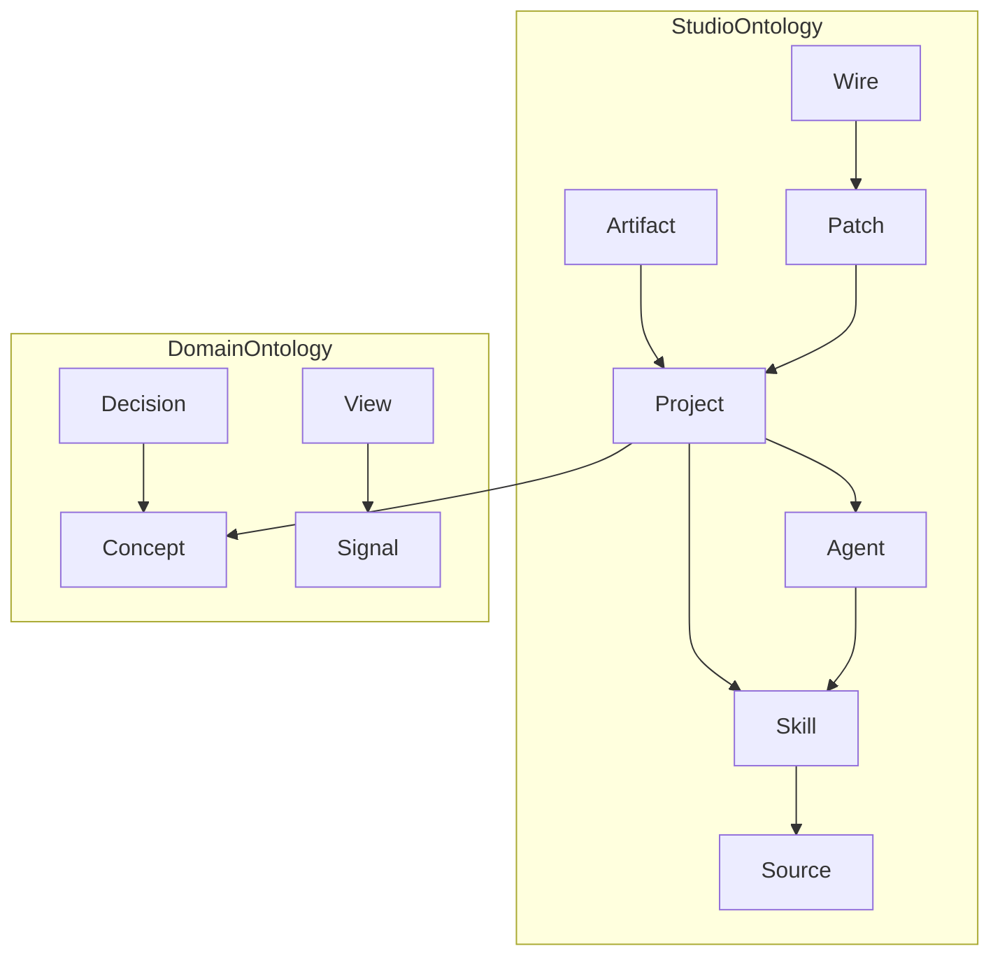
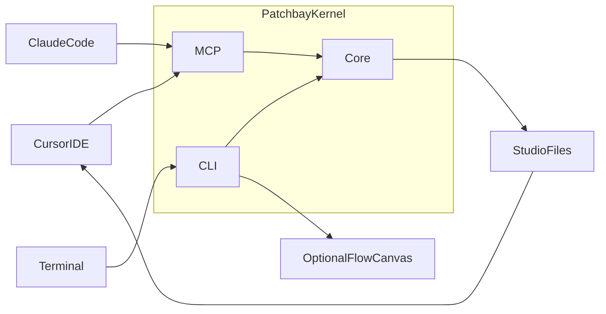
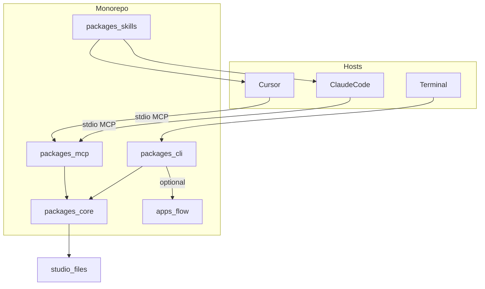

# Patchbay 기획서

| 항목 | 값 |
| --- | --- |
| 문서명 | Patchbay_기획 |
| 버전 | 20260912b |
| 이전 버전 | 20260912a |
| 상태 | 초안 (구현 전, 검토용) |
| 독자 | 제품/아키텍처 검토용 LLM 및 사람 |
| 다음 파일명 | 내용이 바뀌면 `Patchbay_기획_20260912c.md`처럼 같은 날짜에서 접미사만 증가. 날짜가 바뀌면 `Patchbay_기획_YYYYMMDDa.md`로 새로 시작 |

이 문서는 대화에서 합의한 기획을 다른 모델이 **채팅 이력 없이** 검토할 수 있도록 정리한 단일 소스다. 구현 코드는 아직 없다.

b판 변경 요지: 레이어드 정보 구조(L1~L3+, 원칙 9)와 파일 기반 진행 대시보드(Progress 표면, 원칙 10)를 추가했다. a판의 열린 질문(13절)은 아직 결정되지 않았으므로 그대로 남겨둔다.

---

## 0. 검토자에게 바라는 것

아래를 기준으로 반박·구멍·과설계를 지적해 달라.

1. 포지션이 Dify/n8n/Cursor/Claude Code와 실제로 겹치지 않는가.
2. “호스트 LLM이 제안을 쓰고, 커널은 스캔만 한다”가 솔로 빌더 루프에서 마찰을 키우지 않는가.
3. 온톨로지 v0이 너무 크거나, 빠진 클래스가 있는가.
4. 파일이 소스 오브 트루스인 설계가 git·멀티 프로젝트에서 깨지는 지점은 어디인가.
5. v1 범위가 아직도 넓은가. 무엇을 더 잘라야 첫 유용한 슬라이스가 되는가.
6. TypeScript + CLI + MCP + 선택 XYFlow 스택이 이 제품에 맞는가.
7. 레이어 경계(L1/L2/L3)가 결정적으로 유지될 수 있는가, 아니면 결국 요약 LLM이 필요해지는가.
8. 파일 기반 진행 대시보드가 "실시간" 기대를 충분히 충족하는가, 아니면 로컬 워치 서버가 결국 필요한가.

동의하지 않으면 대안을 한 줄이 아니라 **대체 설계**로 적어 달라.

---

## 1. 한 줄 정의

**Patchbay는 여러 LLM 프로젝트를 하나의 스튜디오로 보이게 만드는 로컬 패치 패널이다.**

새 IDE가 아니다. 사용자는 이미 Cursor, Claude Code, 터미널을 쓴다. Patchbay는 그 세 면 아래에 붙는 **커널 + Claude 호환 스킬 + 생성 산출물(마크다운/그래프)** 이다.

오디오 패치베이 은유:

- 랙 → 프로젝트
- 잭 → 스킬, 소스, 모델, 산출물, 시그널
- 라벨 스트립 → 온톨로지
- 케이블 → Patch(의도) / Wire(실제 연동)
- 미터 → 대시보드 가이드

---

## 2. 문제

솔로 빌더가 LLM 프로젝트를 여러 개 굴릴 때 막히는 지점은 “실행 엔진이 없다”가 아니라 **조각이 한눈에 안 보인다**는 것이다.

| 도구 | 잘하는 것 | 비는 것 |
| --- | --- | --- |
| Cursor | 한 레포의 코딩 작업대 | 여러 레포 사이의 관계, 스튜디오 맵 |
| Claude Code | 에이전트 세션, 스킬 실행 | 프로젝트 포트폴리오와 의미 구조 |
| Dify / n8n | 노드 실행과 실행 그래프 | 이 시스템이 무엇을 의미하는지, 지금 기획/구현이 어디인지, 무엇을 관측해야 하는지 |
| 스킬 폴더 / 규칙 파일 | 재사용 단위 | 어느 프로젝트에 무엇을 꽂았는지 |

원래 요청의 키워드:

- Dify/n8n처럼 **다이어그램으로 흐름을 볼 것**
- 프로젝트 **전반 흐름**
- Claude Skills처럼 **LLM을 전반적으로 쓰는 토대**
- **온톨로지**와 **대시보드 가이드를 제안**할 것
- 기획 단계. 런타임 오케스트레이터가 1순위가 아님
- (b판 추가) **정보를 레이어로 나눠 메모리를 아낄 것**, **진행 상황을 옆에서 대시보드로 보여줄 것**

합의된 포지션:

- 제품 유형: **메타 워크스페이스** (기존 Claude/Cursor/API 프로젝트 위에 온톨로지·다이어그램·대시보드 가이드)
- 1차 사용자: **솔로 빌더**
- 1차 면: **Cursor IDE, Claude Code, 터미널** (별도 SaaS/데스크탑 앱 아님)

차별점: 오케스트레이션이 아니라 **조망 + 의미 + 제안**.

---

## 3. 제품 원칙

1. **호스트를 대체하지 않는다.** 코딩은 Cursor, 긴 에이전트 세션은 Claude Code, 조회는 터미널.
2. **커널은 결정적이다.** 스캔·그래프·파일 I/O는 LLM 없이 재현 가능해야 한다.
3. **제안은 호스트 모델이 한다.** Patchbay는 자체 채팅 UI를 만들지 않는다. 온톨로지/대시보드 초안은 스킬이 파일을 쓰고, 수락은 git diff다.
4. **파일이 소스 오브 트루스다.** SQLite/클라우드 DB를 v1 기본값으로 두지 않는다.
5. **세 면에 같은 모델.** CLI와 MCP와 생성 마크다운은 같은 코어 타입을 읽는다.
6. **실행 그래프는 수입할 수 있지만 핵심이 아니다.** n8n/Dify/LangSmith 트레이스는 이후 어댑터. v1 진실 공급원은 로컬 FS와 git.
7. **이름 없는 잭은 부채다.** 온톨로지에 안 올라간 포트는 Atlas에 명시한다.
8. **Patch와 Wire를 구분한다.** Patch는 있어야 한다고 생각한 연결, Wire는 이미 있는 연결. 간격이 할 일이다.
9. **(b판) 정보는 레이어로 나뉜다.** 모든 생성물과 MCP 응답은 최소 3단계 상세도(L1 요약 / L2 개요 / L3 상세)를 가지고, 기본 응답은 항상 L1이다. 레이어는 자연어 압축이 아니라 서로 다른 결정적 집계 함수의 출력이다 (5.6절).
10. **(b판) 진행 상태도 파일이다.** 상시 워치나 로컬 서버 없이, 에이전트가 작업 스텝마다 상태 파일을 갱신한다. "실시간"처럼 보이는 체감은 에디터의 파일 자동 새로고침이 만든다 (5.5절).

---

## 4. v1에서 하지 않는 것

- Dify/n8n 같은 워크플로 실행 엔진
- 멀티유저, 권한, 클라우드 SaaS
- Cursor/Claude를 대체하는 채팅 IDE
- 상시 웹 백엔드가 기본값인 제품
- 범용 BI / 살아있는 Grafana
- 처음부터 Tauri/Electron 데스크탑 앱
- 커널이 API 키로 모델을 직접 돌리는 채팅 루프 (CI/오프라인 필요가 생기기 전)
- (b판) `patchbay watch` 같은 상시 워치 프로세스. 진행 대시보드는 원칙 10에 따라 파일 갱신만으로 만든다.

나중에 열 수 있으나 지금은 닫는 문: 실행 어댑터, `patchbay watch` 상시 워치, 팀 공유, 커널 측 LLM 어댑터, 진행 대시보드의 로컬 워치 서버화(파일 기반으로 부족하다고 판명될 때만).

---

## 5. 다섯 표면 (앱 화면이 아니라 면)

같은 기능이 Cursor / Claude Code / 터미널에 동시에 나타난다.

### 5.1 Atlas — 무엇이 존재하는가

등록된 프로젝트, 스택, 스킬, 문서, 라벨 없는 잭.

- 터미널: `patchbay atlas`
- Cursor: 생성된 `ATLAS.md` 미리보기, MCP `get_atlas`
- Claude Code: 같은 MCP 또는 `map-project` 스킬

### 5.2 Flow — 어떻게 이어지고 지금 어디인가

기본은 실행 DAG가 아니라 **의미·진행 그래프**. 두 모드를 같은 데이터에서 전환한다.

- 아키텍처 모드: 스킬·소스·에이전트·산출물의 배선
- 진행 모드: git, 산출물, (이후) 옵션 트레이스로 본 현재 위치. 스텝 단위의 세부 진행은 5.5 Progress가 담당하고, Flow는 그보다 큰 단위(프로젝트/마일스톤)의 그래프에 집중한다.

표현:

- 기본: `FLOW.md` (Mermaid). IDE/에이전트가 바로 읽음
- 탈출구: `patchbay flow` → 로컬 XYFlow 캔버스 (팬/줌이 필요할 때). 기본 경로 아님

노드의 식별자는 파일/폴더 경로다. 호스트가 에디터로 연다.

### 5.3 Skill Bay — LLM 토대

Claude Agent Skills와 같은 `SKILL.md` 패키지. 스튜디오 공용 스킬을 프로젝트에 패치(심링크 또는 복사).

폴더가 UI다. Cursor 파일 트리 + `patchbay skills`.

Patchbay 자체도 스킬로 동작한다.

- `map-project`
- `propose-ontology`
- `propose-dashboard`

### 5.4 Guide — 온톨로지와 대시보드를 제안

v1 대시보드는 위젯 런타임이 아니라 **가이드 스펙**이다. 프로젝트 유형과 가용 시그널을 보고 “이 네 화면을 보라 / 이 계측이 없다”를 제안하고, 수락하면 파일로 남는다.

### 5.5 Progress — 지금 무엇이 진행 중인가 (b판 신설)

에이전트(Claude Code/Cursor)가 스킬을 실행하거나 여러 단계짜리 작업을 진행할 때 `projects/<alias>/PROGRESS.md`(사람용)와 `progress.yaml`(구조화)을 **스텝마다 직접 갱신**한다. 상시 프로세스나 로컬 서버 없이도, Cursor는 열려 있는 파일이 바뀌면 자동으로 새로고침하기 때문에 "거의 실시간"처럼 체감된다.

- 터미널: `patchbay progress` — 현재 상태를 L1 요약으로 출력
- Cursor: `PROGRESS.md` 미리보기, 파일 변경 시 자동 갱신
- Claude Code: MCP `get_progress`, 또는 채팅에서 "지금 뭐 하고 있어?"에 직접 답

스튜디오 레벨에서는 `<studio>/progress.md`가 프로젝트별 L1 요약을 롤업해 포트폴리오 전체의 "지금 뭐가 돌아가는지"를 보여준다 — 이것이 실질적인 사이드 대시보드 화면이다.

상시 워치(`patchbay watch`)는 v1에서 여전히 닫는 문이다(4절). 이 설계의 목표는 워치 없이 상태 파일만으로 같은 체감을 만드는 것이다. 파일 기반으로 부족하다고 판명되면 로컬 워치 서버로의 단계적 확장을 열린 질문 8에서 재검토한다.

### 5.6 레이어 — 상세도 단계 (b판 신설)

Atlas / Flow / Guide / Progress 네 표면 모두 같은 레이어 규칙을 따른다.

| 레이어 | 내용 | 예 |
| --- | --- | --- |
| L1 요약 | 숫자/상태/경고만, 한 화면 이하 | "Projects: 3, 라벨 없는 잭: 5, 열린 Decision: 2" |
| L2 개요 | 지금의 `ATLAS.md`/`FLOW.md`/`PROGRESS.md` | 사람이 훑어보는 문서 |
| L3 상세 | 원본 발췌, `inferred.json` 전체 | `get_project_bundle`이 주는 자료 |
| L4+ | 필요시 L3를 챕터별로 재분할 | 프로젝트가 커졌을 때만, 온디맨드 |

레이어는 압축이 아니라 서로 다른 결정적 집계 함수의 출력이다(원칙 9). L1은 카운트/상태 필드만 뽑는 함수, L2는 기존 스캐너 규칙, L3는 원본 그대로 — 셋 다 커널이 LLM 없이 만든다. 사람이 읽는 자연어 요약이 필요하면 그건 레이어가 아니라 `propose-*`류 스킬과 동급으로 취급해 호스트 LLM이 쓰고 diff로 남긴다.

구현:

- 파일 분리: 커널이 `ATLAS.md`(L2) 옆에 `ATLAS.digest.md`(L1)를 같이 쓴다.
- MCP 파라미터화: `get_atlas`, `get_graph`, `get_project_bundle`, `get_progress`에 `level` 인자를 추가한다. 기본값은 1.
- CLI: `--level` 플래그. 예: `patchbay atlas --level 1`.

온톨로지 영향: 새 클래스를 만들지 않는다. `Artifact`/`View`에 `layer: 1|2|3|N` 속성만 추가한다(7.6절).

---

## 6. 사용자 루프

1. `patchbay init`으로 스튜디오를 만들고 로컬 폴더를 등록한다.
2. 스캐너가 git, README, `SKILL.md`, `AGENTS.md`, `CLAUDE.md`, `.cursor/rules`를 읽는다.
3. `inferred.json`, `ATLAS.md`, `ATLAS.digest.md`, `FLOW.md`가 생긴다. 라벨 없는 잭이 보인다.
4. Cursor 또는 Claude Code에서 `propose-ontology` / `propose-dashboard`를 실행한다. 실행 중에는 `PROGRESS.md`가 갱신되어 Cursor에서 진행 상황을 바로 볼 수 있다.
5. 초안이 `ontology/`, `DASHBOARD.md`, `overlay.yaml`에 쓰인다. 사용자가 diff로 남기거나 되돌린다.
6. Skill Bay에서 공용 스킬을 프로젝트에 패치한다.
7. 다음 `scan`(또는 이후 watch)이 맵을 갱신한다. 필요하면 `patchbay atlas --level 1`로 요약만 먼저 확인하고, `patchbay progress`로 지금 무엇이 진행 중인지 확인한다.

---

## 7. 온톨로지 v0

두 층을 섞지 않는다.

- **스튜디오 온톨로지:** Patchbay가 모든 프로젝트를 이해하는 메타 모델. 제품이 고정한다.
- **도메인 온톨로지:** 그 프로젝트가 다루는 개념. Guide가 제안하고 사용자가 다듬는다.

### 7.1 스튜디오 클래스

| 클래스 | 의미 |
| --- | --- |
| Studio | 한 사람의 전체 작업 공간 |
| Project | 로컬 레포 또는 Claude 프로젝트 |
| Skill | `SKILL.md` 패키지 |
| Agent | 모델 + 도구 + 스킬 + 지시 |
| Source | 문서, 트랜스크립트, API, 데이터 |
| Artifact | 코드, 리포트, 생성된 가이드, 캔버스 스냅샷 |
| Patch | 의도된 의미 연결 (아직 없을 수 있음) |
| Wire | 실제로 존재하는 연동 |

### 7.2 도메인 클래스

| 클래스 | 의미 |
| --- | --- |
| Concept | 도메인 엔티티 |
| Decision | 선택과 근거 |
| Signal | 측정 가능 값 (git 활동, 비용, eval, 열린 질문 수, 현재 진행 스텝) |
| View | 대시보드 또는 다이어그램 스펙 (Progress 화면 포함) |

### 7.3 관계 (초안)

- Project has Skill, has Agent, has Source, has Artifact
- Agent uses Skill
- Skill reads Source
- Artifact producedBy Agent or Skill or human
- Patch connects (fromPort, toPort, kind)
- Wire implements Patch (또는 Patch 없이 발견된 연동)
- Concept definedIn Project
- View observes Signal
- Decision supersedes Decision, about Concept

### 7.4 핵심 긴장

```
할 일 = Patch − Wire
온톨로지 부채 = 발견된 포트 − 라벨된 포트
```

### 7.5 관계 스케치



### 7.6 레이어와 진행 속성 (b판 신설)

- `Artifact`와 `View`에 `layer: 1|2|3|N` 속성을 추가한다. 새 클래스는 만들지 않는다(온톨로지 팽창 방지).
- 진행 대시보드는 새 클래스가 아니라 기존 조합으로 표현한다: `Signal`의 한 종류로 "현재 진행 스텝"을 두고, `View`의 한 서브타입("progress")이 그 Signal을 observe한다.
- `progress.yaml`은 이 Signal의 결정적 저장소이고, `PROGRESS.md`는 그 View의 L2 렌더링이다.

---

## 8. 아키텍처

### 8.1 역할

| 층 | 역할 | 비고 |
| --- | --- | --- |
| Kernel (`packages/core`) | 스캔, 그래프, YAML/JSON I/O, 스킬 인덱스, Patch/Wire diff, 레이어 집계 | LLM 없음 |
| CLI (`packages/cli`) | 터미널 면. `init scan atlas flow skills patch progress` | 코어 호출 |
| MCP (`packages/mcp`) | Cursor / Claude Code 면. stdio | 코어 호출 |
| Skills (`packages/skills`) | 호스트 에이전트용 `SKILL.md` | 제안은 여기서 파일을 씀. 실행 중 `progress.yaml` 갱신도 스킬 규약에 포함 |
| Host UI | Cursor 미리보기, Claude 대화, 터미널 stdout | 제품 프론트 |
| Optional Flow (`apps/flow`) | Vite + React + XYFlow | `patchbay flow`일 때만 |

채팅 앱을 만들지 않는 이유: 사용자는 이미 더 좋은 에이전트 면을 가지고 있고, 제안 결과는 git 가능한 파일이어야 한다.





### 8.2 스택

| 선택 | 결정 | 이유 |
| --- | --- | --- |
| 언어 | TypeScript | MCP SDK, Cursor 생태계, CLI/MCP/캔버스 타입 공유 |
| 모노레포 | pnpm | 패키지 경계가 제품 경계와 같음 |
| 런타임 | Node 22+ (Bun 가능) | 로컬 FS, stdio MCP |
| 스키마 | Zod | 문서 온톨로지 = 실행 스키마 |
| 마크다운 프론트매터 | gray-matter | `SKILL.md` |
| git | simple-git | 진행 모드 |
| YAML | yaml | 사람이 편집하는 레지스트리/오버레이/`progress.yaml` |
| 워치 | chokidar | `flow`일 때만. 진행 대시보드는 파일 기반이라 기본은 미사용(4절) |
| MCP | `@modelcontextprotocol/sdk` | Cursor·Claude Code 공통 |
| 선택 HTTP | Hono | `patchbay flow` 짧은 로컬 서버 |
| 선택 UI | Vite + React + `@xyflow/react` | n8n형 캔버스 탈출구 |
| DB | 없음. `inferred.json`이 캐시 | 파일이 진실 |

Python을 안 쓰는 이유: 스캔은 언어 이점이 작고, 면이 세 개로 갈라지면 공유 타입이 더 중요하다.

상시 Node 서버 + SPA를 기본값으로 두지 않는 이유: 솔로 빌더는 이미 IDE/에이전트/셸을 켜 둔다.

### 8.3 데이터 흐름

1. `scan`이 등록 루트를 읽고 `inferred.json` + `ATLAS.md`(+`ATLAS.digest.md`) + `FLOW.md`를 쓴다. LLM 없음.
2. 에이전트가 MCP `get_project_bundle`으로 재료를 가져간다(기본 L1, 필요시 `level` 올려서 재요청).
3. 스킬이 온톨로지/대시보드 초안을 `ontology/`와 overlay에 쓰면서, 동시에 `progress.yaml`을 스텝마다 갱신한다.
4. 사용자가 Cursor에서 diff를 보고, `PROGRESS.md` 자동 새로고침으로 진행 상황을 본다.
5. `patch`가 스킬을 링크/복사하고 overlay에 Wire를 기록한다.
6. Flow 캔버스는 같은 그래프 JSON을 읽기만 한다.

### 8.4 CLI (초안)

```
patchbay init
patchbay project add <path> [--alias]
patchbay scan [--project <alias>]
patchbay atlas [--level 1|2|3]
patchbay skills
patchbay patch <skill> <project>
patchbay progress [--project <alias>] [--level 1|2|3]
patchbay flow          # 선택 캔버스
```

### 8.5 MCP 툴 (초안)

| 툴 | 역할 |
| --- | --- |
| `list_projects` | 스튜디오 레지스트리 |
| `get_atlas` | Atlas 요약. `level` 인자(기본 1) |
| `get_graph` | Flow용 노드/엣지 JSON. `level` 인자 |
| `get_project_bundle` | 제안용 재료 (스캔 요약 + 핵심 파일 발췌). `level`, `scope` 인자 |
| `get_progress` | 현재 진행 상태 (b판 신설). `level` 인자 |
| `patch_skill` | 스킬을 프로젝트에 패치 |
| `record_decision` | Decision을 overlay에 기록 |

리소스 예: `studio://project/{alias}/flow`

커널은 제안을 “실행”하지 않는다. 재료와 쓰기 위치를 알려 준다.

---

## 9. 로컬 스튜디오 파일 형식 (초안)

스튜디오 루트는 사용자 홈 또는 지정 디렉터리. 앱 UI보다 이 트리가 먼저 존재해야 한다.

```
<studio>/
  studio.yaml
  progress.md                        # (b판) 전체 포트폴리오 진행 롤업, L1
  ontology/
    studio.yaml
    <alias>.yaml
  skills/
    map-project/SKILL.md
    propose-ontology/SKILL.md
    propose-dashboard/SKILL.md
  projects/
    <alias>/
      overlay.yaml
      inferred.json
      ATLAS.md
      ATLAS.digest.md                # (b판) L1 요약
      FLOW.md
      DASHBOARD.md
      PROGRESS.md                    # (b판) L2 진행 로그
      progress.yaml                  # (b판) L2 구조화 진행 상태
```

### 9.1 `studio.yaml`

```yaml
version: 1
name: han-studio
projects:
  - alias: patchbay
    path: /Users/han/Documents/Claude/Projects/Patchbay
    kind: local_repo
```

### 9.2 `projects/<alias>/overlay.yaml`

사람이 소유하는 레이어. 스캔이 덮어쓰지 않는다.

```yaml
version: 1
alias: patchbay
patches:
  - from: skill:propose-ontology
    to: artifact:ontology
    kind: proposes
wires:
  - from: source:README
    to: skill:map-project
    kind: reads
    evidence: README.md
decisions: []
accepted_guides:
  ontology: ontology/patchbay.yaml
  dashboard: DASHBOARD.md
```

### 9.3 `inferred.json`

생성물. git에 넣을지 여부는 미결. 스캐너 출력(파일 목록, 스킬, 규칙, git 요약, 발견 포트). L3 레이어의 원본 소스.

### 9.4 생성 마크다운

호스트 프론트. `scan` 또는 스킬이 갱신. 긴 서사 문서는 여기 두지 않고, 맵과 가이드만 둔다. `ATLAS.digest.md`/`PROGRESS.md`는 각각 Atlas/Progress의 L1·L2 레이어다.

### 9.5 `progress.yaml` (b판 신설)

에이전트가 스텝마다 갱신하는 구조화 상태. 커널은 이 파일을 읽어 `PROGRESS.md`와 스튜디오 `progress.md`를 재생성할 수 있지만, 쓰기는 에이전트(스킬)가 한다 — 커널이 "지금 뭘 하는지"를 알 방법이 없기 때문(결정적 원칙과 상충하지 않도록, 진행 기록 자체는 원칙 3의 "제안"과 같은 취급).

```yaml
version: 1
alias: patchbay
current:
  skill: propose-ontology
  step: "3/5 라벨 없는 잭 이름 제안 중"
  started_at: 2026-09-12T10:03:00+09:00
history:
  - skill: map-project
    finished_at: 2026-09-12T09:55:00+09:00
    result: ok
```

---

## 10. 내장 스킬 초안

Claude/Cursor 스킬 규약을 따른다. 디렉터리 + `SKILL.md`.

### `map-project`

스캔 결과를 읽고 Atlas/Flow 마크다운이 최신인지 확인하거나 `patchbay scan`을 호출하게 한다. 결정적 코어를 대체하지 않는다. 실행 시작/종료를 `progress.yaml`에 기록한다.

### `propose-ontology`

`get_project_bundle` 재료로 도메인 클래스·관계·라벨 없는 잭 이름을 제안하고 `ontology/<alias>.yaml`에 초안을 쓴다. 기존 파일이 있으면 덮어쓰지 말고 diff 가능한 패치를 선호한다. 진행 중 각 하위 단계를 `progress.yaml`에 기록한다.

### `propose-dashboard`

온톨로지와 가용 Signal을 보고 View 4–7개를 제안한다. 없는 계측은 “갭”으로 적는다. 출력은 `DASHBOARD.md` (무엇을 왜 보는지 + 이후 런타임이 읽을 수 있는 YAML 블록). 진행 중 각 하위 단계를 `progress.yaml`에 기록한다.

모든 내장 스킬은 공통 규약을 따른다: 시작 시 `progress.yaml.current`를 쓰고, 종료 시 `history`로 옮긴다. 이 규약은 스킬 SKILL.md 템플릿에 고정 문구로 포함한다(구현 단계에서 헬퍼 함수화 검토).

---

## 11. 레포 뼈대 (합의 후)

이 Patchbay 레포 자체는 제품 코드의 집이다. 사용자 스튜디오 데이터는 기본적으로 레포 밖.

```
Patchbay/
  docs/
    Patchbay_기획_20260912a.md
    Patchbay_기획_20260912b.md    # 이 문서
  packages/core/
  packages/cli/
  packages/mcp/
  packages/skills/
  apps/flow/
```

---

## 12. 구현 순서 (합의 후)

문서를 쪼개 고정하는 것과 코드를 섞지 않는다. 이 파일이 검토를 통과하면:

1. 이 기획을 유지한 채 스키마만 Zod로 옮긴다 (레이어/진행 속성 포함).
2. 한 로컬 폴더를 스캔해 `ATLAS.md` / `ATLAS.digest.md` / `FLOW.md`를 쓰는 최소 CLI.
3. 같은 코어를 감싼 MCP (`level` 파라미터 포함).
4. `progress.yaml`/`PROGRESS.md` 규약과 세 내장 스킬.
5. Mermaid가 답답해지면 XYFlow. 파일 기반 Progress가 답답해지면 로컬 워치 서버.

첫 유용한 슬라이스의 성공 조건: **등록한 레포 하나를 스캔했을 때, Cursor에서 Atlas와 Flow 마크다운만 보고도 스킬·규칙·빈 잭을 말할 수 있다.**

---

## 13. 열린 질문

검토자가 우선 답하거나 반박해 주었으면 하는 것.

1. 스튜디오 루트를 `~/.patchbay`에 둘 것인가, 제품 레포 안에 둘 것인가.
2. `inferred.json`과 생성 마크다운을 git에 넣을 것인가.
3. 스킬 패치는 심링크가 기본인가, 복사인가. Claude Code 스킬 로더와 어떻게 맞출 것인가.
4. 여러 레포에 같은 스킬이 있을 때 정본은 Skill Bay인가, 각 레포인가.
5. 진행 모드의 git 신호를 어느 깊이까지 볼 것인가 (커밋 메시지 vs 파일 diff vs Cursor 트랜스크립트).
6. Cursor 트랜스크립트/에이전트 로그를 스캔하는 것은 프라이버시상 v1에 넣을 것인가.
7. 도메인 온톨로지 표기를 YAML로 둘 것인가, JSON-LD/RDF까지 염두에 둘 것인가. v1은 단순 YAML을 전제로 한다.
8. `patchbay flow`가 localhost를 여는 것이, “별도 앱을 안 만든다” 원칙과 충돌하는가. Mermaid만으로 v1을 끝낼 것인가.
9. (b판) 레이어 경계(L1/L2/L3)의 집계 규칙을 스킬/표면마다 다르게 둘 것인가, 커널에 공통 인터페이스로 강제할 것인가.
10. (b판) `progress.yaml`을 여러 에이전트(예: Cursor 세션 + Claude Code 세션)가 동시에 갱신할 때 충돌을 어떻게 막을 것인가 (파일 락 vs 마지막 쓰기 우선 vs append-only 로그).

---

## 14. 결정 로그

| 날짜 | 결정 |
| --- | --- |
| 2026-09-12 | 메타 워크스페이스. 실행 엔진 아님 |
| 2026-09-12 | 1차 사용자 = 솔로 빌더 |
| 2026-09-12 | 면 = Cursor, Claude Code, 터미널. 웹/Tauri 기본값 아님 |
| 2026-09-12 | 커널 결정적, 제안은 호스트 LLM |
| 2026-09-12 | TypeScript pnpm 모노레포, CLI + MCP, 선택 XYFlow |
| 2026-09-12 | 파일 소스 오브 트루스, SQLite 없음 |
| 2026-09-12 | 문서 파일명 = `문서명_YYYYMMDD` + 버전 접미사 a,b,c… |
| 2026-09-12 | (b판) 정보는 레이어(L1~L3+)로 나눠 기본 응답은 최소 레이어. 레이어는 압축이 아니라 결정적 집계 함수의 출력 |
| 2026-09-12 | (b판) 진행 대시보드는 파일 기반(PROGRESS.md/progress.yaml)으로 결정. 상시 워치는 v1에서 계속 닫는 문 |

---

## 15. 변경 이력

| 버전 | 날짜 | 내용 |
| --- | --- | --- |
| 20260912a | 2026-09-12 | 최초 통합 기획서. 포지션, 온톨로지 v0, 면, 아키텍처, 파일 형식, 비범위 |
| 20260912b | 2026-09-12 | 레이어드 정보 구조(L1~L3+, 5.6/7.6/9.4절, 원칙 9) 추가. 파일 기반 진행 대시보드(Progress 표면, 5.5/9.5/10절, 원칙 10) 추가. 열린 질문 2건 추가(9, 10) |
