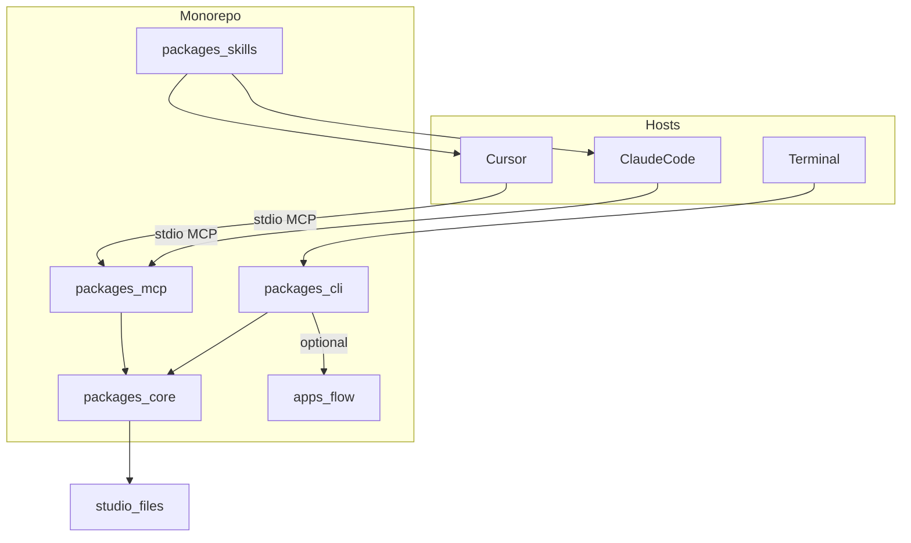
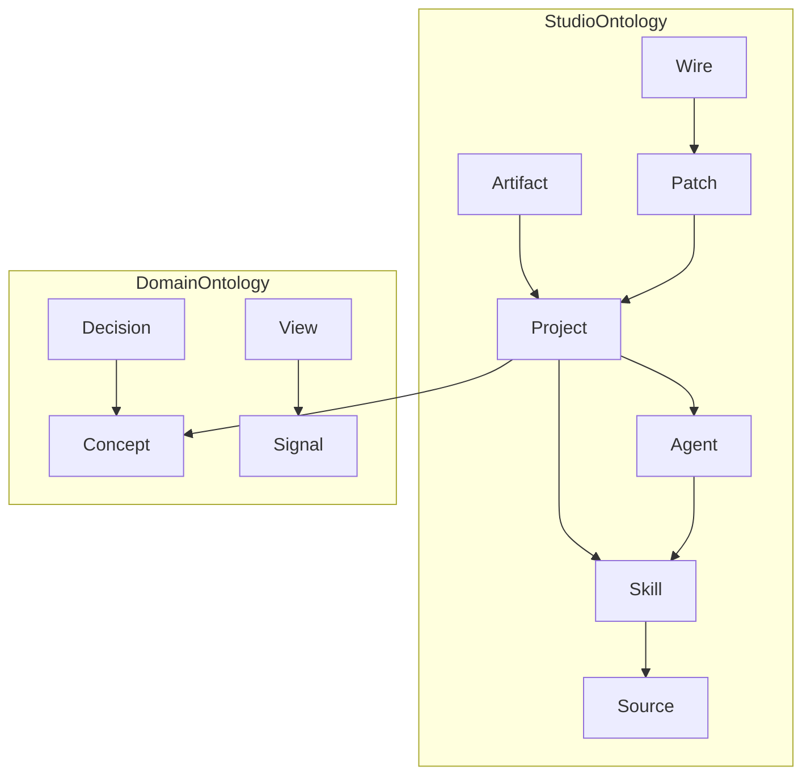
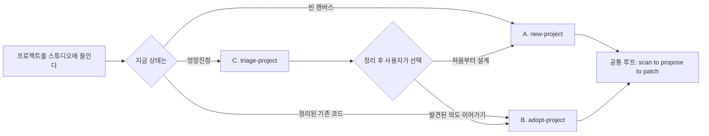
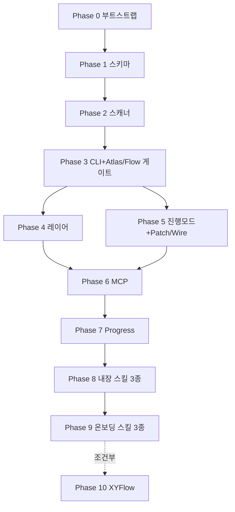

# Patchbay 명세서 (다이어그램 + 체크리스트)

| 항목 | 값 |
| --- | --- |
| 문서명 | Patchbay_명세 |
| 버전 | 20260912a |
| 기반 문서 | `Patchbay_기획_20260912c.md`, `Patchbay_구현계획_20260912a.md` |
| 용도 | 구현 중 계속 열어두고 "지금 하는 게 맞는 방향인지" 점검하는 문서 |
| 갱신 규칙 | 기반 문서가 바뀌면 이 문서도 같이 갱신할 것. 이 문서 혼자 최신일 수 없다 |

이 문서는 새로운 결정을 담지 않는다. 이미 정한 내용을 **다이어그램**과 **체크리스트**로 압축해서, 구현 중 빠르게 대조해볼 수 있게 만든 것이다.

---

## 1. 한눈에 보는 다이어그램

### 1.1 시스템 아키텍처

핵심 규칙: **MCP와 CLI는 반드시 Core를 거친다.** 둘 중 하나가 Core를 건너뛰고 직접 파일을 조작하기 시작하면 "세 면에 같은 모델"(원칙 5)이 깨진 것이다.

### 1.2 온톨로지 관계

핵심 규칙: 새 클래스를 추가하고 싶은 유혹이 들면 먼저 **속성으로 표현할 수 없는지** 확인한다 (예: `layer`는 클래스가 아니라 Artifact/View의 속성).

### 1.3 온보딩 3-시나리오 흐름

핵심 규칙: **C는 종착점이 아니다.** triage-project가 끝났는데 A나 B로 안내하지 않고 거기서 끝나면 설계 위반이다.

### 1.4 Phase 의존 관계

---

## 2. 원칙 자가 점검 (11개, 아무 때나 다시 읽을 것)

- [ ] 1. 호스트를 대체하는 UI를 만들고 있지는 않은가
- [ ] 2. 커널이 LLM을 호출하고 있지는 않은가 (결정적이어야 함)
- [ ] 3. 스킬이 사용자 확인 없이 파일을 덮어쓰고 있지는 않은가
- [ ] 4. SQLite/클라우드 DB를 슬쩍 기본값으로 쓰고 있지는 않은가
- [ ] 5. CLI/MCP/마크다운이 서로 다른 타입을 쓰고 있지는 않은가
- [ ] 6. 실행 그래프(n8n류) 기능이 핵심으로 슬금슬금 들어오고 있지는 않은가
- [ ] 7. 라벨 없는 잭이 방치되고 있지는 않은가
- [ ] 8. Patch와 Wire를 같은 것으로 취급하고 있지는 않은가
- [ ] 9. L1 요약이 "압축"이 아니라 다른 결정적 집계 함수의 출력인가
- [ ] 10. 상시 워치/서버가 몰래 켜지고 있지는 않은가
- [ ] 11. triage가 파일을 삭제하지 않고 `_archive/`로만 옮기고 있는가

---

## 3. Phase별 체크리스트 + 이상 신호

각 Phase는 "완료 조건"(끝났다고 볼 수 있는 기준)과 "이상 신호"(이게 보이면 방향이 틀어진 것)로 구성.

### Phase 0 — 부트스트랩
- [ ] `pnpm install` 성공
- [ ] `pnpm -r build` 성공
- [ ] 첫 커밋 존재
- ⚠ 이상 신호: 계획에 없던 패키지가 늘어난다 / 코드가 패키지 경계 없이 아무 데나 들어간다

### Phase 1 — 코어 스키마
- [ ] Project/Skill/Agent/Source/Artifact/Patch/Wire 스키마 존재
- [ ] Concept/Decision/Signal/View 스키마 존재
- [ ] 각 스키마 파싱 테스트 통과
- ⚠ 이상 신호: 스키마 없이 아무 객체나 넘기는 코드가 생긴다 (원칙 5 위반 조짐)

### Phase 2 — 결정적 스캐너
- [ ] 픽스처 레포 스캔 스냅샷 테스트 통과
- [ ] 같은 폴더를 두 번 스캔해도 결과 동일
- ⚠ 이상 신호: 스캐너 코드 안에 API 키/모델 호출이 등장한다 (원칙 2 위반)

### Phase 3 — CLI + Atlas/Flow (게이트)
- [ ] `ATLAS.md`, `FLOW.md` 생성됨
- [ ] Cursor에서 이 문서만 보고 스킬·규칙·빈 잭을 설명 가능
- [ ] **며칠 실사용 후 "유용하다"는 판단이 실제로 내려졌다**
- ⚠ 이상 신호: 검증 없이 바로 Phase 4로 넘어간다 / "일단 기능부터 더 만들자"는 이유로 게이트를 건너뛴다

### Phase 4 — 레이어(L1/L3)
- [ ] `ATLAS.digest.md`(L1) 생성됨
- [ ] `--level` 옵션 동작
- [ ] L1/L2/L3의 숫자(카운트)가 서로 일치
- ⚠ 이상 신호: L1이 L2 텍스트를 그냥 잘라서 만든 것이다 (원칙 9 위반)

### Phase 5 — 진행모드 + Patch/Wire
- [ ] `overlay.yaml` 읽기/쓰기 동작
- [ ] 스킬 patch 후 Wire가 기록됨
- [ ] Patch − Wire 갭이 Atlas/Flow에 표시됨
- ⚠ 이상 신호: 스캔이 `overlay.yaml`을 덮어쓴다 (사람 소유 레이어 침범) / 심링크 실패를 조용히 무시한다

### Phase 6 — MCP 래퍼
- [ ] Cursor/Claude Code에서 MCP로 Atlas 조회 성공(수동 확인)
- ⚠ 이상 신호: MCP 툴이 Core를 거치지 않고 파일을 직접 조작한다

### Phase 7 — Progress 표면
- [ ] `progress.yaml` 갱신 시 `PROGRESS.md` 재생성됨
- [ ] 스튜디오 롤업(`progress.md`) 동작
- ⚠ 이상 신호: 상시 워치 프로세스가 몰래 켜진다 (원칙 10 위반) / 커널이 `progress.yaml`을 직접 쓴다 (에이전트만 써야 함)

### Phase 8 — 내장 스킬 3종
- [ ] `map-project`/`propose-ontology`/`propose-dashboard` 실행 시 diff 가능한 초안 생성
- ⚠ 이상 신호: 스킬이 확인 없이 바로 파일을 확정 적용한다 (원칙 3 위반)

### Phase 9 — 온보딩 스킬 3종
- [ ] A/B/C 세 시나리오 각각 수동 워크스루 완료
- [ ] C가 A 또는 B로 안내하며 끝남
- ⚠ 이상 신호: `triage-project`가 파일을 삭제한다 (원칙 11 위반) / `adopt-project`가 확인 전에 `progress.yaml`을 기록한다

### Phase 10 — XYFlow (조건부)
- [ ] 착수 전 "Mermaid로 안 되는 구체적 사례"가 기록되어 있음
- ⚠ 이상 신호: 실사용 근거 없이 그냥 만들기 시작한다

---

## 4. 미확정 열린 질문 (구현 중 마주치면 여기부터 확인)

| # | 질문 | 임시 채택값 |
| --- | --- | --- |
| Q1 | 스튜디오 루트 위치 | `~/.patchbay` |
| Q2 | studio 홈 git 관리 | Phase 0에서 별도 git init |
| Q3 | 심링크 vs 복사 | 심링크 기본, 실패 시 복사 |
| Q4 | 스킬 정본 위치(멀티 레포) | 미확정 |
| Q5 | git 신호 깊이 | 커밋 메시지+branch만 |
| Q6 | 트랜스크립트 스캔 | v1 OFF |
| Q7 | 온톨로지 표기 | YAML |
| Q8 | flow localhost 원칙 충돌 | v1은 Mermaid만, XYFlow 보류 |
| Q9 | clarity score 정의 | 룰 기반 가중합(v0) |
| Q10 | `_needs-review` 방치 처리 | 미확정 |
| Q11 | 빠른 시작 기본값 | 한 줄 정의+성공 조건만 질문 |
| Q12 | adopt-project 오추정 반복 마찰 | 미확정 |

---

## 5. 참고

- 무엇을 만들지 → `Patchbay_기획_20260912c.md`
- 어떤 순서로 만들지 → `Patchbay_구현계획_20260912a.md`
- 지금 맞게 가고 있는지 → 이 문서
