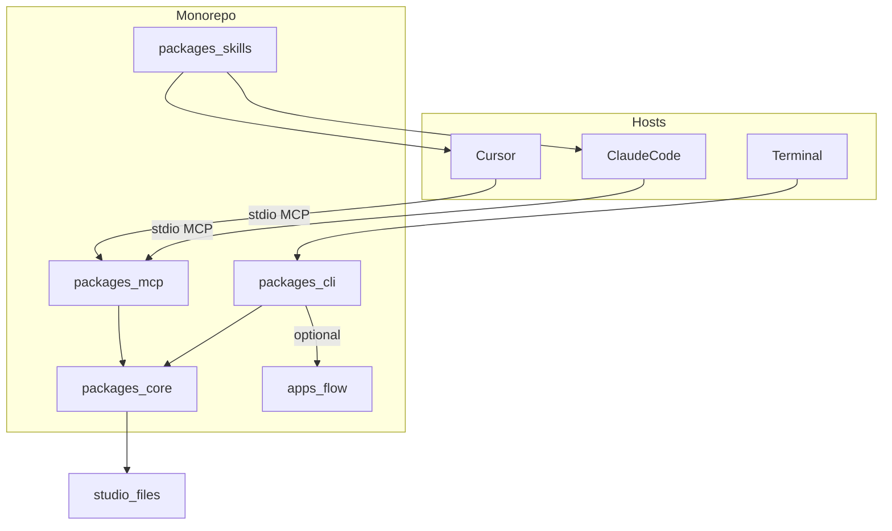
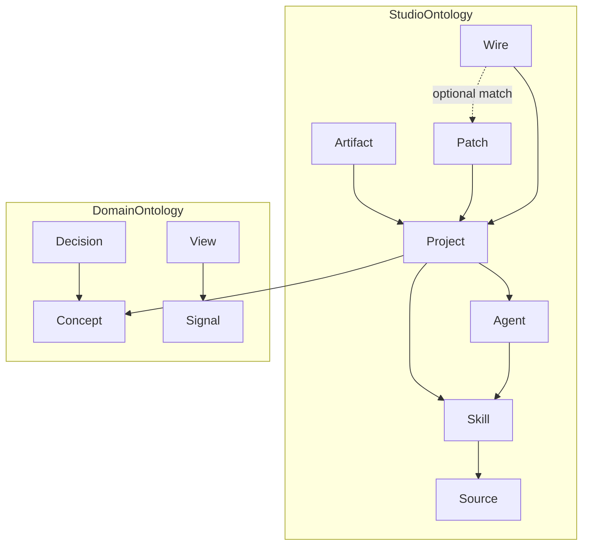
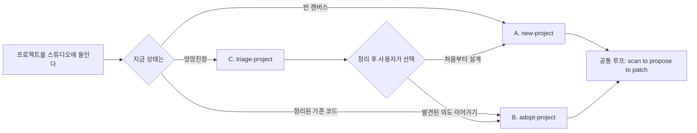
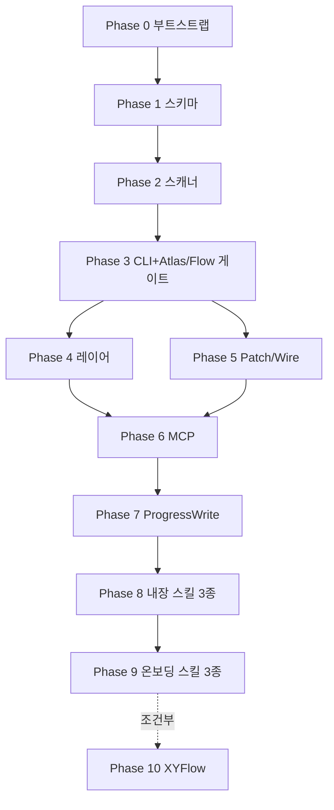

# Patchbay 명세서 (다이어그램 + 체크리스트)

| 항목 | 값 |
| --- | --- |
| 문서명 | Patchbay_명세 |
| 버전 | 20260912b |
| 이전 버전 | `Patchbay_명세_20260912a.md` |
| 기반 문서 | `Patchbay_기획_20260912c.md`, `Patchbay_구현계획_20260912a.md` |
| 용도 | 구현 중 계속 열어두고 "지금 하는 게 맞는 방향인지" 점검하는 문서 |
| 갱신 규칙 | 기반 문서가 바뀌면 이 문서도 같이 갱신할 것. **6절(임시 채택값)이 기획·구현계획과 충돌하면 구현이 시작되기 전까지는 6절이 이긴다.** 기획/구현계획 다음 개정에서 이 절을 흡수할 것 |

a판은 체크리스트만 있고 필드·식별자·트리거가 비어 구현이 갈라졌다. b판은 그 구멍을 **임시 채택값**으로 메운다. 제품 포지션을 바꾸지 않는다. 뒤집을 때는 파일명 접미사만 올리고 6절과 4절 표를 함께 고친다.

---

## 1. 한눈에 보는 다이어그램

### 1.1 시스템 아키텍처



핵심 규칙: **MCP와 CLI는 반드시 Core를 거친다.** 둘 중 하나가 Core를 건너뛰고 직접 파일을 조작하기 시작하면 "세 면에 같은 모델"(원칙 5)이 깨진 것이다.

### 1.2 온톨로지 관계



핵심 규칙:

- 새 클래스를 추가하고 싶으면 먼저 **속성으로 표현할 수 없는지** 확인한다 (`layer`는 Artifact/View의 속성).
- **Wire는 Patch의 자식이 아니다.** Patch 없이 발견된 연동이 있을 수 있다. 점선은 매칭이지 필수 종속가 아니다.
- **Agent는 스키마에만 있다.** v1 스캐너는 Agent를 채우지 않는다 (6.8절).

### 1.3 온보딩 3-시나리오 흐름



핵심 규칙: **C는 종착점이 아니다.** triage-project가 끝났는데 A나 B로 안내하지 않고 거기서 끝나면 설계 위반이다.

v1 triage가 해도 되는 이동은 `_archive/`와 `_needs-review/`뿐이다. 살아있는 코드의 클러스터 재배치는 범위 밖이다 (6.5절).

### 1.4 Phase 의존 관계



Phase 5 이름에서 "진행모드"를 뺀다. git 타임라인은 Q5 범위(브랜치+커밋 제목)만 Atlas/Flow에 넣고, 스텝 단위 진행은 Phase 7 `progress write`가 담당한다.

---

## 2. 원칙 자가 점검 (13개)

- [ ] 1. 호스트를 대체하는 UI를 만들고 있지는 않은가
- [ ] 2. 커널이 LLM을 호출하고 있지는 않은가
- [ ] 3. 확정 파일(`ontology/<alias>.yaml`, `DASHBOARD.md`)을 확인 없이 덮어쓰고 있지는 않은가. 초안은 `*.proposed.*`만
- [ ] 4. SQLite/클라우드 DB를 슬쩍 기본값으로 쓰고 있지는 않은가
- [ ] 5. CLI/MCP/마크다운이 서로 다른 타입을 쓰고 있지는 않은가
- [ ] 6. 실행 그래프(n8n류) 기능이 핵심으로 들어오고 있지는 않은가
- [ ] 7. 라벨 없는 잭이 방치되고 있지는 않은가 (discovered − labeled)
- [ ] 8. Patch와 Wire를 같은 것으로 취급하고 있지는 않은가. 매칭 키는 `(from, to, kind)`
- [ ] 9. L1이 L2 텍스트를 잘라 만든 것은 아닌가. 숫자는 같은 집계 함수에서 나와야 한다
- [ ] 10. 상시 워치/서버가 몰래 켜지고 있지는 않은가. Progress는 `progress write` 한 방이 yaml+md를 쓴다
- [ ] 11. triage가 삭제하거나, `_archive/`·`_needs-review/` 밖으로 파일을 옮기고 있지는 않은가
- [ ] 12. stdin이 TTY가 아닌데 프롬프트를 기다리고 있지는 않은가
- [ ] 13. 생성 파일(Atlas/Flow/inferred)을 사람이 고친 내용을 보존하려고 스캔을 건너뛰고 있지는 않은가. 커널 소유 파일은 다음 scan이 덮어쓴다

---

## 3. Phase별 체크리스트 + 이상 신호

완료 조건은 **자동으로 확인 가능한 것**을 앞에 둔다. 주관적 게이트는 따로 표시한다.

### Phase 0 — 부트스트랩

- [ ] `pnpm install` 성공
- [ ] `pnpm -r build` 성공
- ⚠ 이상 신호: 계획에 없던 패키지가 늘어난다 / 코드가 패키지 경계 없이 아무 데나 들어간다

### Phase 1 — 코어 스키마

6.1~6.3절 필드가 스키마에 있어야 한다. 클래스 이름만 있는 Zod는 미완료.

- [ ] `PortId` 파싱/실패 테스트
- [ ] Patch/Wire 매칭 함수 테스트 (매칭 / Patch만 / Wire만)
- [ ] Project/Skill/Source/Artifact/Patch/Wire 필수 필드 파싱
- [ ] Agent는 스키마만 있고 빈 배열이 허용
- [ ] Concept/Decision/Signal/View 파싱
- [ ] overlay / inferred / progress / studio.yaml shape
- [ ] `pnpm --filter core test` 통과
- ⚠ 이상 신호: `z.record(z.unknown())`으로 온톨로지를 퉁친다 / PortId를 자유 문자열로 둔다

### Phase 2 — 결정적 스캐너

- [ ] 픽스처 스캔 스냅샷 통과 (배열은 PortId/path 오름차순, volatile 필드 없음 — 6.7절)
- [ ] 같은 픽스처를 두 번 스캔한 JSON이 byte-level로 동일
- [ ] 라벨 없는 잭 = discovered ports (온톨로지 없으면 전부 unlabeled)
- [ ] `agents`는 항상 `[]`
- [ ] git 필드에 ahead/behind 없음
- ⚠ 이상 신호: API 키/모델 호출 / `readdir` 순서를 그대로 씀 / mtime을 inferred에 넣음

### Phase 3 — CLI + Atlas/Flow (게이트)

기계적 완료:

- [ ] `ATLAS.md`에 고정 제목 `## Skills`, `## Rules`, `## Unlabeled ports`가 있고 각 섹션에 항목 또는 `없음`
- [ ] `FLOW.md`의 Mermaid 노드 id는 `n_` + PortId SHA-1 앞 12자. 라벨만 경로
- [ ] `project add --path` 비대화형: 성공 시 exit 0, triage 권고 시 exit 2, 프롬프트 없음 (6.6절)
- [ ] `project new`는 `--path` 없으면 exit 1

제품 게이트 (구현 Done이 아님):

- [ ] 며칠 실사용 후 포트폴리오 조망이 유용하다는 판단

⚠ 이상 신호: 기계적 조건만 건너뛰고 주관적 게이트를 Done으로 적는다 / 검증 없이 Phase 4로 간다

### Phase 4 — 레이어(L1/L3)

- [ ] `ATLAS.digest.md`는 집계 함수 출력. L2 마크다운을 `slice`하지 않음
- [ ] L1/L2/L3가 **같은 카운트 객체**를 렌더한다 (`projects`, `skills`, `rules`, `unlabeledPorts`)
- [ ] CLI `atlas` 기본은 L2 파일. `--level 1`은 digest. MCP `get_atlas` 기본 `level=1`. 이 차이는 버그가 아니다 (6.9절)
- ⚠ 이상 신호: L1 숫자를 L2 텍스트에서 정규식으로 추출한다

### Phase 5 — Patch/Wire

- [ ] 스캔이 `overlay.yaml`을 쓰지 않음
- [ ] `patch` 성공 시 Wire 기록 + `install: symlink | copy`
- [ ] 심링크 실패 시 복사하고 `install: copy`. 조용히 성공인 척 하지 않음
- [ ] Atlas/Flow에 `patchesWithoutWire` / `wiresWithoutPatch` 표시
- ⚠ 이상 신호: Wire를 Patch 자식으로만 저장한다 / 매칭 키에 `evidence`를 넣는다

### Phase 6 — MCP 래퍼

- [ ] 툴 4개만: `list_projects`, `get_atlas`, `get_graph`, `get_project_bundle`. 전부 Core 호출
- [ ] in-process Client/Server 테스트가 각 툴에 1개 이상 (`stdio라 자동화 불가`는 이 문서에서 폐기)
- [ ] Cursor 또는 Claude Code에서 Atlas 조회 수동 확인
- ⚠ 이상 신호: MCP가 파일을 직접 연다 / Phase 6에 `patch_skill`을 끼워 넣는다 (`patch_skill`/`record_decision`은 Phase 5 CLI가 먼저, MCP 노출은 그 다음)

### Phase 7 — Progress write

- [ ] `patchbay progress write`가 **한 프로세스에서** `progress.yaml` + `PROGRESS.md` + 스튜디오 `progress.md`를 쓴다
- [ ] 워치 없음. yaml만 바꾸고 md가 따라 갱신되길 기다리지 않음
- [ ] 커널은 현재 작업을 추론하지 않음. yaml의 `current`는 이 명령의 인자에서만 온다
- ⚠ 이상 신호: chokidar로 yaml을 감시한다 / 스캔이 `progress.yaml`을 채운다

### Phase 8 — 내장 스킬 3종

- [ ] 확정 파일이 있으면 `ontology/<alias>.proposed.yaml`, `DASHBOARD.proposed.md`에만 초안을 씀
- [ ] 스킬이 `progress write`를 시작/종료에 호출하라고 SKILL.md에 적혀 있다
- ⚠ 이상 신호: 확정 파일을 바로 덮는다

### Phase 9 — 온보딩 스킬 3종

- [ ] `project new <alias> --path <abs>`만 허용
- [ ] `triage-plan.json` + `patchbay triage apply`. apply는 `_archive/YYYYMMDD/`와 `_needs-review/` 밖이면 실패
- [ ] 삭제 없음. 살아있는 소스 트리 재배치 없음
- [ ] C 종료 문구가 A 또는 B를 고르라고 한다
- [ ] `adopt-project`는 사용자 확인 전에 `progress write --set-current`를 하지 말라고 SKILL.md에 적혀 있다
- ⚠ 이상 신호: 스킬이 `mv`로 프로젝트를 재구성한다 / TTY 질문을 기본 경로로 둔다

### Phase 10 — XYFlow (조건부)

- [ ] 착수 전 "Mermaid로 안 되는 구체적 사례"가 기록되어 있음
- ⚠ 이상 신호: 실사용 근거 없이 만든다

---

## 4. 열린 질문

| # | 질문 | 이 버전에서의 값 |
| --- | --- | --- |
| Q1 | 스튜디오 루트 | `~/.patchbay`, `PATCHBAY_HOME`으로 override |
| Q2 | studio 홈 git | Phase 0에서 별도 `git init` |
| Q3 | 심링크 vs 복사 | 심링크 기본, 실패 시 복사, Wire에 `install` 기록 |
| Q4 | 스킬 정본 (멀티 레포) | v1은 단일 스튜디오. 정본은 `<studio>/skills/`. 멀티 레포 정본 충돌은 미룸 |
| Q5 | git 신호 깊이 | 현재 브랜치 이름 + HEAD sha + 최근 커밋 제목 20개. **ahead/behind 없음** |
| Q6 | 트랜스크립트 스캔 | v1 OFF |
| Q7 | 온톨로지 표기 | YAML |
| Q8 | flow localhost | v1 Mermaid만. XYFlow 보류 |
| Q9 | clarity score | 6.10절 공식. 40 미만만 exit 2 |
| Q10 | progress 동시 갱신 / `_needs-review` 방치 | 동시 갱신: last-write-wins, 문서화만. `_needs-review` 방치: Atlas unlabeled와 같이 카운트만, 자동 정리 없음 |
| Q11 | 빠른 시작 기본값 | 한 줄 정의 + 성공 조건만 질문. 1차 사용자=나, 면=터미널+Cursor |
| Q12 | adopt 오추정 마찰 | 미확정. 완화는 "확인 전 current 금지"만 |
| Q13 | 생성 파일 git | studio 홈 git에 생성 파일을 넣는다 (Q2). 대상 프로젝트 git에는 넣지 않음 |
| Q14 | `studio.yaml` kind | v1은 `local_repo`만 |

---

## 5. 참고

- 무엇을 만들지 → `Patchbay_기획_20260912c.md`
- 어떤 순서로 만들지 → `Patchbay_구현계획_20260912a.md` (6절과 충돌하면 이 문서 6절)
- 지금 맞게 가고 있는지 → 이 문서
- a판에서 지적한 구현 구멍의 원문 → 대화 검토 / `spec-implementability-review` 캔버스

---

## 6. 구현 구멍 임시 채택값

이 절이 b판의 본문이다. 구현 시작 전 고정값. 제품 원칙을 뒤집지 않는 선에서만 골랐다.

### 6.1 PortId

```
PortId     = kind ":" ref
kind       = "source" | "skill" | "artifact" | "agent" | "signal"
ref        = fileRef | slug
fileRef    = 프로젝트 루트 기준 POSIX 상대경로. 선두 "./" 없음. 역슬래시 없음
slug       = [a-z0-9][a-z0-9-]*     # 스튜디오 Skill Bay 이름
```

예:

- `source:README.md`
- `source:.cursor/rules/general.mdc`
- `skill:map-project` — `<studio>/skills/map-project/`
- `skill:skills/local-foo/SKILL.md` — 프로젝트 안 스킬 파일
- `artifact:ATLAS.md` — 스튜디오 메타 산출물은 파일명 slug

파싱 실패(빈 kind, 공백, `..`, 절대경로)는 스키마 에러다. 자유 문자열 PortId는 허용하지 않는다.

### 6.2 Patch / Wire 매칭

두 레코드 공통 필드:

```yaml
from: skill:map-project      # PortId
to: artifact:ATLAS.md        # PortId
kind: produces               # 짧은 slug. v0 추천값: reads | produces | proposes | uses
```

Wire만 추가:

```yaml
evidence: README.md          # 선택. 매칭 키에 안 넣음
install: symlink             # 스킬 패치일 때만. symlink | copy
```

- **매칭 키** = `(from, to, kind)` 문자열 완전 일치.
- **할 일** = 키가 Wire에 없는 Patch (`patchesWithoutWire`).
- **발견된 연동** = 키가 Patch에 없는 Wire (`wiresWithoutPatch`). 버그가 아니라 정상.
- overlay 예시는 키가 다를 수 있다. 갭으로 표시하면 된다. 억지로 짝을 맞추지 않는다.
- 스캔은 overlay를 읽기만 하고 쓰지 않는다.

### 6.3 라벨 없는 잭 (v0)

**Discovered ports** (스캐너, LLM 없음):

| 발견 | PortId |
| --- | --- |
| `SKILL.md` (어떤 깊이든, ignore 제외) | `skill:<부모디렉터리의 상대 POSIX>` — 스튜디오 Bay와 이름이 같으면 `skill:<slug>` |
| `README.md`, `README.*`, `AGENTS.md`, `CLAUDE.md` | `source:<상대경로>` |
| `.cursor/rules` 파일, 또는 그 디렉터리의 `*.md`, `*.mdc` | `source:<상대경로>` |

**Labeled ports**: `ontology/<alias>.yaml`의 `ports[].id`에 있는 PortId. 파일이 없으면 labeled = 공집합.

**Unlabeled** = discovered − labeled.

Phase 2에서 온톨로지가 없으면 발견된 잭이 전부 unlabeled다. 정상이다.

`ontology/<alias>.yaml` v0 최소 모양:

```yaml
version: 1
alias: patchbay
ports:
  - id: source:README.md
    label: 프로젝트 소개
concepts: []
```

### 6.4 파일 소유권과 초안

| 파일 | 소유 | 다음 scan |
| --- | --- | --- |
| `inferred.json`, `ATLAS.md`, `ATLAS.digest.md`, `FLOW.md` | 커널 | **항상 덮어씀**. 사람이 고친 내용은 사라진다. 메모는 overlay |
| `excavation.json` | 커널 (triage 스캔) | triage 스캔이 덮어씀 |
| `overlay.yaml` | 사람 + 명시적 CLI (`patch`, `record`) | 스캔이 **쓰지 않음** |
| `ontology/<alias>.yaml`, `DASHBOARD.md` | 사람이 수락한 확정본 | 스캔이 쓰지 않음 |
| `ontology/<alias>.proposed.yaml`, `DASHBOARD.proposed.md` | 스킬 초안 | 스캔이 쓰지 않음. 확정본이 있으면 스킬은 여기만 씀 |
| `progress.yaml`, `PROGRESS.md`, `<studio>/progress.md` | `progress write`만 | 스캔이 쓰지 않음 |

확정본이 있는데 스킬이 확정 경로에 쓰면 원칙 3 위반이다. 커널 write API는 확정 경로 overwrite를 거절하고 proposed 경로를 안내한다.

대상 프로젝트 레포에는 스튜디오 생성 파일을 넣지 않는다 (Q13). 워크스페이스가 프로젝트만 열려 있으면 Atlas diff는 `~/.patchbay`를 열어야 보인다. v1 제한으로 적는다.

### 6.5 `project new` / triage apply

```
patchbay project new <alias> --path <abs>
```

`--path` 없으면 실패. 경로를 추측해 `~/Projects/<alias>`를 만들지 않는다. 디렉터리가 없으면 생성, 비어 있지 않으면 실패.

triage v1:

1. `patchbay project triage --path <abs>` → `excavation.json`만 씀. 파일 이동 없음.
2. 스킬이 `triage-plan.json`을 씀 (from/to 목록).
3. `patchbay triage apply --project <alias>`가 이동을 수행.

apply가 **허용하는 to** (프로젝트 루트 상대):

- `_archive/YYYYMMDD/...`
- `_needs-review/...`

그 밖(소스 재배치, 이름 변경, 다른 드라이브)은 실패. 삭제는 없다. 클러스터별 살아있는 코드 재배치는 v1 범위 밖이다.

`excavation.json` 스키마는 Phase 9에서 추가한다. Phase 1에 넣지 않는다.

### 6.6 비대화형 CLI

stdin이 TTY가 아니거나 `--json`이면 질문을 하지 않는다.

`project add --path`:

| 상황 | exit | stdout |
| --- | --- | --- |
| 등록·스캔 성공 | 0 | 요약 |
| clarity < 40 (triage 권고) | 2 | 권고와 점수. **등록하지 않음** |
| 인자 오류 | 1 | 에러 |

플래그:

- `--interactive` — TTY에서만 질문 허용
- `--force-add` — clarity와 무관하게 등록 (exit 0)
- `--json` — 기계 출력

에이전트/스킬 문서의 기본은 비대화형이다. 기본 경로에서 `readline`으로 멈추면 버그다.

### 6.7 스캔 결정성과 ignore

ignore (디렉터리 이름 또는 이 경로 세그먼트):

`node_modules`, `.git`, `dist`, `build`, `out`, `.next`, `coverage`, `.turbo`, `.cache`, `venv`, `.venv`, `__pycache__`, `target`, `vendor`, `.pnpm-store`, `Pods`, `.output`

inferred 안정화:

- 모든 배열은 `path` 또는 PortId 오름차순
- `mtime`, `scannedAt`, 로컬 시계, 파일 크기(선택 시에도 스냅샷 비교에서 제외) 없음
- git: `branch`, `head`, `commitSubjects: string[≤20]`
- **ahead/behind 없음** (fetch 금지)

"두 번 스캔하면 같다"는 **같은 커밋의 픽스처**에 대해서만 주장한다.

### 6.8 v1에서 스캐너가 하지 않는 것

- Agent 인스턴스 채우기 → `agents: []`. overlay에 사람이 넣는 것은 나중.
- git ahead/behind
- Cursor/Claude 트랜스크립트
- 원격 fetch
- `progress.yaml` 추론
- 도메인 Concept 추출 (호스트 스킬 몫)

Phase 1에 Agent 스키마를 두는 것은 맞다. 테스트는 "빈 배열 파싱"이면 충분하다.

### 6.9 레이어 기본값 (의도된 차이)

- 사람이 읽는 파일: `ATLAS.md` = L2, `ATLAS.digest.md` = L1. `atlas` 무옵션은 L2를 보여 주거나 생성한다.
- MCP: 토큰을 아끼려고 `level` 기본 1.
- 카운트 객체는 하나다. 레이어는 그 객체를 얼마나 풀어 쓰느냐만 다르다.

### 6.10 clarity score v0

0–100, 높을수록 정리됨.

- README.md 존재: +30
- 최근 커밋 제목 유니크 비율: `unique(subjects) / max(n,1) * 30` (n≤20)
- 중복 파일명 패턴(`_v2`, `_final`, `_backup`, ` copy`, `복사본`): 개당 −5, 바닥 −30
- 그 외 0

임계값: **40 미만만** exit 2. 40–60은 등록하고 메모만. 애매하면 triage를 강요하지 않는다.

### 6.11 Progress write

```
patchbay progress write --project <alias> --skill <slug> --step "<text>"
patchbay progress write --project <alias> --finish ok|error
```

한 호출이 `progress.yaml`을 갱신한 뒤 같은 프로세스에서 `PROGRESS.md`와 `<studio>/progress.md`를 렌더한다. 워치 없음.

커널은 "지금 무엇을 하는지"를 git으로 추측하지 않는다. `--step` 없는 write는 실패다.

"실시간 옆 대시보드"는 v1 성공 조건이 아니다. 파일이 열린 탭에서 갱신되면 그뿐이고, 보장하지 않는다.

### 6.12 MCP Phase 6 범위

구현하는 툴: `list_projects`, `get_atlas`, `get_graph`, `get_project_bundle`.

`patch_skill`, `record_decision`은 Phase 6 완료 조건이 아니다. CLI가 먼저다.

테스트: `@modelcontextprotocol/sdk`로 같은 프로세스에서 서버를 붙인다. "stdio라 수동만"은 폐기한다.

### 6.13 Mermaid 노드

- id: `n` + hex(sha1(PortId))[0..12]
- 표시 라벨: PortId 또는 상대경로. 따옴표로 감싼다
- 원본 경로를 노드 id에 쓰지 않는다 (공백·괄호·한글 경로 파손 방지)

### 6.14 이번 채택에서 명시적으로 빼는 것

- Agent 자동 탐지
- git ahead/behind
- triage의 살아있는 코드 재배치
- 워치 기반 Progress
- 실시간 대시보드 체감을 완료 조건으로 삼기
- Phase 6에서 쓰기 툴까지 한 번에 넣기
- `project new`의 경로 추측

---

## 7. 변경 이력

| 버전 | 날짜 | 내용 |
| --- | --- | --- |
| 20260912a | 2026-09-12 | 최초 명세. 다이어그램 + Phase 체크리스트 |
| 20260912b | 2026-09-12 | 구현 구멍 임시 채택값(6절). PortId, Patch/Wire 매칭, 잭 정의, 파일 소유권, 비대화형 CLI, progress write, triage apply 범위, 스캐너 비범위. 다이어그램에서 Wire⊂Patch 종속 제거 |
