# Patchbay 명세서 (다이어그램 + 체크리스트)

| 항목 | 값 |
| --- | --- |
| 문서명 | Patchbay_명세 |
| 버전 | 20260913c |
| 이전 버전 | `Patchbay_명세_20260913b.md` |
| 기반 문서 | `Patchbay_기획_20260913a.md`, `Patchbay_구현계획_20260913b.md` |
| 용도 | 구현 중 계속 열어두고 "지금 하는 게 맞는 방향인지" 점검하는 문서 |
| 갱신 규칙 | 7절(임시 채택값)이 기획·구현계획과 충돌하면 구현 시작 전까지는 7절이 이긴다. 기획/구현계획 다음 개정에서 흡수할 것 |

20260913c판 변경 요지: Phase 3 게이트의 "며칠 실사용" 대신 합의한 **약식 실사용(직접 `init`/`project add`/`atlas` 실행)** 중, 자동 테스트로는 못 잡는 실제 결함을 하나 발견해 고쳤다 — 스캐너가 자기 자신의 테스트 픽스처(`__fixtures__` 안의 가짜 README/AGENTS.md/SKILL.md)를 진짜 신호로 읽어버렸다(clarity score까지 오염됨). 7.7절 ignore 목록에 `__fixtures__`/`__mocks__`/`__snapshots__`를 추가하고, 실제 코드(`fileWalker.ts`)와 회귀 테스트도 함께 반영했다. 이 문서는 그 결정을 기록하는 것 — 코드는 이미 고쳐서 머지 대기 중이다.

---

## 1. 한눈에 보는 다이어그램

### 1.1 시스템 아키텍처

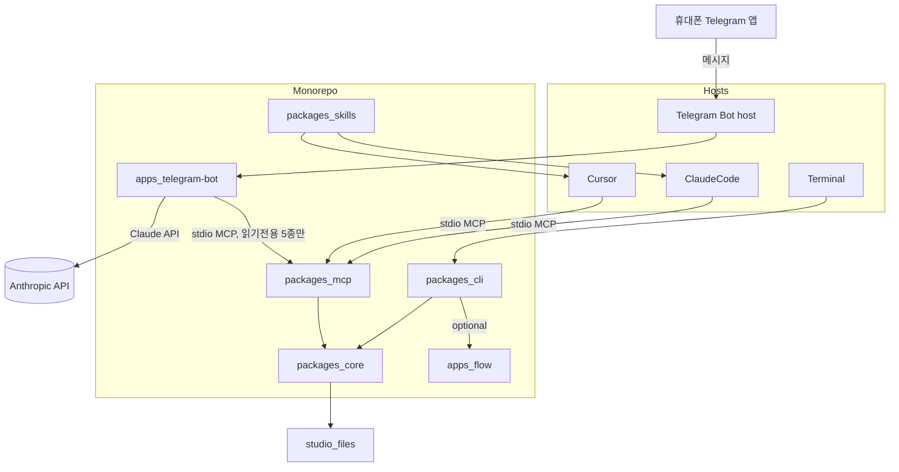

핵심 규칙: **MCP와 CLI는 반드시 Core를 거친다.** 텔레그램 호스트도 다른 호스트와 동일하게 MCP를 거쳐 Core에 접근한다 — Core를 직접 열지 않는다. (20260913a판 추가) **멀티 에이전트 역할 분담도 같은 규칙을 따른다** — 리더/워커 세션은 각각 Cursor/ClaudeCode/Terminal 중 하나일 뿐, Patchbay가 그 사이를 직접 잇는 별도 통로를 만들지 않는다. 조율은 `assignments.yaml`이라는 studio 파일로만 오간다.

### 1.2 온톨로지 관계

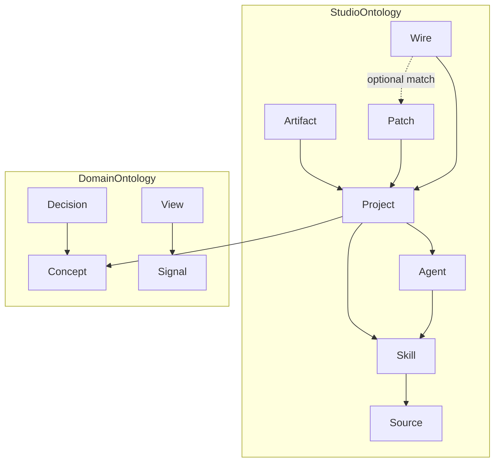

핵심 규칙:

- 새 클래스를 추가하고 싶으면 먼저 **속성으로 표현할 수 없는지** 확인한다.
- **Wire는 Patch의 자식이 아니다.** Patch 없이 발견된 연동이 있을 수 있다.
- **Agent는 스키마에만 있다.** v1 스캐너는 Agent를 채우지 않는다 (6.8절). (20260913a판) Phase 12부터 `Agent`가 처음으로 **사람 손으로** 채워지기 시작한다 — 자동 탐지가 생기는 것은 아니다.

### 1.3 온보딩 3-시나리오 흐름

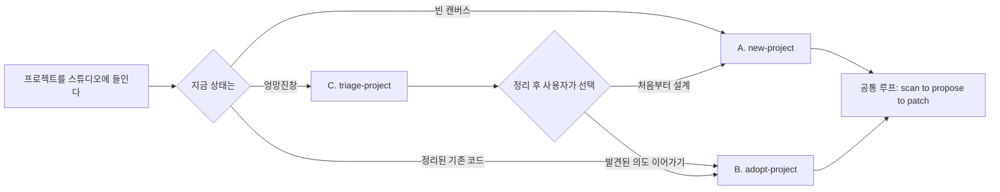

핵심 규칙: **C는 종착점이 아니다.** v1 triage가 해도 되는 이동은 `_archive/`와 `_needs-review/`뿐이다(6.5절). ⚠ 이 범위는 기획서_c 6.3절의 원래 서술(살아있는 코드 클러스터 재배치 포함)보다 좁다 — 기획서 다음 개정에서 반드시 동기화할 것(8절 참고).

### 1.4 Phase 의존 관계

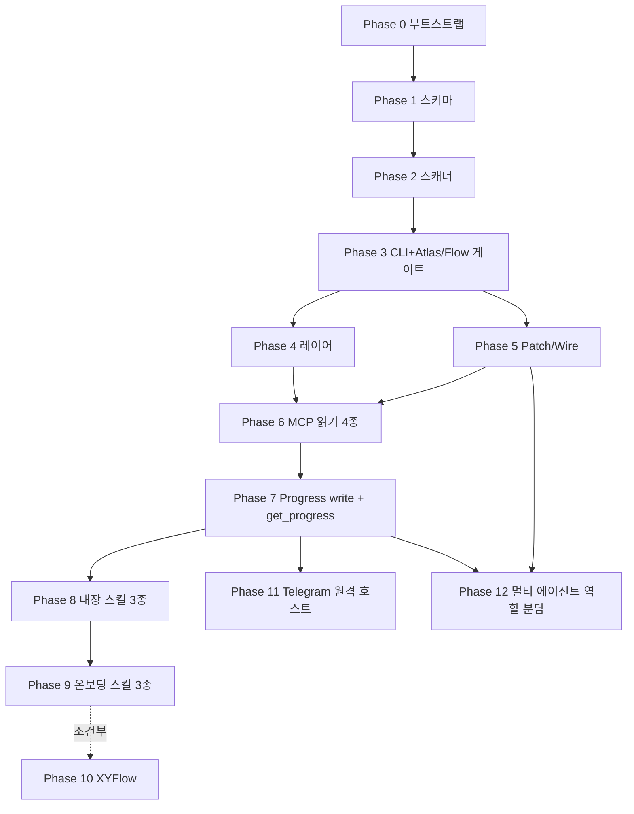

---

## 2. 원칙 자가 점검 (15개)

- [ ] 1. 호스트를 대체하는 UI를 만들고 있지는 않은가
- [ ] 2. 커널이 LLM을 호출하고 있지는 않은가
- [ ] 3. 확정 파일(`ontology/<alias>.yaml`, `DASHBOARD.md`)을 확인 없이 덮어쓰고 있지는 않은가. 초안은 `*.proposed.*`만
- [ ] 4. SQLite/클라우드 DB를 슬쩍 기본값으로 쓰고 있지는 않은가
- [ ] 5. CLI/MCP/마크다운이 서로 다른 타입을 쓰고 있지는 않은가
- [ ] 6. 실행 그래프(n8n류) 기능이 핵심으로 들어오고 있지는 않은가
- [ ] 7. 라벨 없는 잭이 방치되고 있지는 않은가 (discovered − labeled)
- [ ] 8. Patch와 Wire를 같은 것으로 취급하고 있지는 않은가. 매칭 키는 `(from, to, kind)`
- [ ] 9. L1이 L2 텍스트를 잘라 만든 것은 아닌가. 숫자는 같은 집계 함수에서 나와야 한다
- [ ] 10. 상시 워치/서버가 몰래 켜지고 있지는 않은가. Progress는 `progress write` 한 방이 yaml+md를 쓴다
- [ ] 11. triage가 삭제하거나, `_archive/`·`_needs-review/` 밖으로 파일을 옮기고 있지는 않은가
- [ ] 12. stdin이 TTY가 아닌데 프롬프트를 기다리고 있지는 않은가
- [ ] 13. 생성 파일(Atlas/Flow/inferred)을 사람이 고친 내용을 보존하려고 스캔을 건너뛰고 있지는 않은가
- [ ] 14. 텔레그램 호스트가 화이트리스트 없는 chat에 응답하거나, 읽기 이외의 툴(쓰기/삭제)을 노출하고 있지는 않은가
- [ ] 15. (20260913a판 신설) 리더가 워커의 실행을 자동으로 트리거하거나 폴링하고 있지는 않은가 — `assignments.yaml`은 사람이 각자 세션에서 읽고 쓰는 파일일 뿐, 그 사이를 잇는 코드(API 호출, 셸 실행, 알림)가 생기면 원칙 6 위반이다

---

## 3. Phase별 체크리스트 + 이상 신호

### Phase 0 — 부트스트랩 ✅ 완료 (`bca1f1b`)

- [x] `pnpm install` 성공
- [x] `pnpm -r build` 성공
- ⚠ 이상 신호: 계획에 없던 패키지가 늘어난다 / 코드가 패키지 경계 없이 아무 데나 들어간다

### Phase 1 — 코어 스키마 ✅ 완료 (`cbe47cb`)

- [x] `PortId` 파싱/실패 테스트 (6.1절 규칙 포함 — slug/fileRef 모호성 케이스도 테스트)
- [x] Patch/Wire 매칭 함수 테스트 (매칭 / Patch만 / Wire만)
- [x] Project/Skill/Source/Artifact/Patch/Wire 필수 필드 파싱
- [x] Agent는 스키마만 있고 빈 배열이 허용
- [x] Concept/Decision/Signal/View 파싱
- [x] overlay / inferred / progress / studio.yaml shape
- [x] `pnpm --filter core test` 통과 (65 tests)
- ⚠ 이상 신호: `z.record(z.unknown())`으로 온톨로지를 퉁친다 / PortId를 자유 문자열로 둔다
- 검토 중 발견: `project.ts`의 `matchKey` 템플릿 리터럴에 스페이스 대신 널 바이트 2개가 섞여 있었음(테스트는 통과했으나 git이 파일을 바이너리로 인식해 발견) — `a7e3b5f`에서 수정

### Phase 2 — 결정적 스캐너 ✅ 완료 (`ae8471a`)

- [x] 픽스처 스캔 스냅샷 통과 (배열은 PortId/path 오름차순, volatile 필드 없음)
- [x] 같은 픽스처를 두 번 스캔한 JSON이 byte-level로 동일
- [x] 라벨 없는 잭 = discovered ports (온톨로지 없으면 전부 unlabeled)
- [x] `agents`는 항상 `[]`
- [x] git 필드에 ahead/behind 없음
- ⚠ 이상 신호: API 키/모델 호출 / `readdir` 순서를 그대로 씀 / mtime을 inferred에 넣음
- 검토 중 발견: ignore 목록 테스트용 `dist`/`node_modules` 픽스처 파일이 루트 `.gitignore`에 걸려 커밋된 적이 없었음(머지 직후엔 "걸러져서 없음"이 아니라 "애초에 없어서 없음"이라 테스트가 무의미했다) — `.gitignore`에 해당 픽스처 경로만 예외 처리하고 파일을 복원(`795f304`)
- (20260913c판 추가) Phase 3 실사용 검증 중 발견: ignore 목록에 `__fixtures__` 계열이 없어서, 실제 프로젝트(Patchbay 자기 자신)를 스캔하면 스캐너 자신의 테스트 픽스처가 진짜 신호로 잡혔다 — 격리된 임시 픽스처만 스캔하는 자동 테스트로는 안 잡히는 종류의 결함. 7.7절에 `__fixtures__`/`__mocks__`/`__snapshots__` 추가로 수정

### Phase 3 — CLI + Atlas/Flow (게이트) ✅ 기계적 완료 (`cb60795`), 제품 게이트는 미판정

기계적 완료:

- [x] `ATLAS.md`에 고정 제목 `## Skills`, `## Rules`, `## Unlabeled ports`가 있고 각 섹션에 항목 또는 `없음` (콘텐츠 매핑은 7.18절)
- [x] `FLOW.md`의 Mermaid 노드 id는 **`n` + PortId SHA-1 해시(hex) 앞 12자** — 6.13절과 정확히 동일한 규칙. 언더스코어 없음. 라벨만 경로
- [x] `project add --path` 비대화형: 성공 시 exit 0, triage 권고 시 exit 2, 프롬프트 없음 (6.6절)
- [x] `project new`는 `--path` 없으면 exit 1
- [x] `project add`/`scan` 완료 시 `ATLAS.md`의 **절대경로**를 stdout에 출력 (6.15절, Atlas 가시성 완화)
- (`packages/core` 139 tests + `packages/cli` 39 tests, 전체 빌드 클린. 모든 테스트가 `PATCHBAY_HOME`을 임시 디렉터리로 강제 — 실제 `~/.patchbay`는 건드리지 않음을 검토자가 직접 확인)

(20260913c판) **약식 실사용 1회 완료**: 실제로 `patchbay init` → `project add --path <Patchbay 레포>` → `atlas`를 사람이 직접 실행. 위 ignore 목록 결함을 그 자리에서 발견·수정했고, 수정 후 재스캔 결과는 정확함(Patchbay 레포 자체엔 인식 대상 신호 파일이 없어 `## Skills`/`## Rules`/`## Unlabeled ports` 전부 `없음` — 버그 아니라 사실 그대로). 다만 이건 "핵심 기계가 정확히 동작하는가"를 확인한 것이고, "조망이 실제로 유용한가"는 신호가 있는(README/AGENTS.md 등을 실제로 가진) 다른 프로젝트로 한 번 더 시도해봐야 제대로 판단 가능 — 아래 항목은 그래서 아직 미체크.

제품 게이트 (구현 Done이 아님, 아직 판정 안 됨):

- [ ] 며칠 실사용 후 포트폴리오 조망이 유용하다는 판단

⚠ 이상 신호: 기계적 조건만 건너뛰고 주관적 게이트를 Done으로 적는다 / 검증 없이 Phase 4로 간다

### Phase 4 — 레이어(L1/L3)

- [ ] `ATLAS.digest.md`는 집계 함수 출력. L2 마크다운을 `slice`하지 않음
- [ ] L1/L2/L3가 **같은 카운트 객체**를 렌더한다
- [ ] CLI `atlas` 기본은 L2 파일. `--level 1`은 digest. MCP `get_atlas` 기본 `level=1`. 이 차이는 버그가 아니다
- ⚠ 이상 신호: L1 숫자를 L2 텍스트에서 정규식으로 추출한다

### Phase 5 — Patch/Wire

- [ ] 스캔이 `overlay.yaml`을 쓰지 않음
- [ ] `patch` 성공 시 Wire 기록 + `install: symlink | copy`
- [ ] 심링크 실패 시 복사하고 `install: copy`. 조용히 성공인 척 하지 않음
- [ ] Atlas/Flow에 `patchesWithoutWire` / `wiresWithoutPatch` 표시
- ⚠ 이상 신호: Wire를 Patch 자식으로만 저장한다 / 매칭 키에 `evidence`를 넣는다

### Phase 6 — MCP 래퍼 (읽기 전용 4종)

- [ ] 툴 4개만: `list_projects`, `get_atlas`, `get_graph`, `get_project_bundle`. 전부 Core 호출
- [ ] in-process Client/Server 테스트가 각 툴에 1개 이상
- [ ] Cursor 또는 Claude Code에서 Atlas 조회 수동 확인
- ⚠ 이상 신호: MCP가 파일을 직접 연다 / Phase 6에 `patch_skill`이나 `get_progress`를 끼워 넣는다

### Phase 7 — Progress write + get_progress

- [ ] `patchbay progress write`가 **한 프로세스에서** `progress.yaml` + `PROGRESS.md` + 스튜디오 `progress.md`를 쓴다
- [ ] 워치 없음. yaml만 바꾸고 md가 따라 갱신되길 기다리지 않음
- [ ] 커널은 현재 작업을 추론하지 않음. yaml의 `current`는 이 명령의 인자에서만 온다
- [ ] MCP `get_progress(level)` 노출 — Core의 progress 읽기 함수를 호출하며 Phase 6의 4종 툴과 같은 방식으로 테스트
- ⚠ 이상 신호: chokidar로 yaml을 감시한다 / 스캔이 `progress.yaml`을 채운다 / `get_progress` 없이 Phase 7을 완료로 표시한다

### Phase 8 — 내장 스킬 3종

- [ ] 확정 파일이 있으면 `ontology/<alias>.proposed.yaml`, `DASHBOARD.proposed.md`에만 초안을 씀
- [ ] 스킬이 `progress write`를 시작/종료에 호출하라고 SKILL.md에 적혀 있다
- ⚠ 이상 신호: 확정 파일을 바로 덮는다

### Phase 9 — 온보딩 스킬 3종

- [ ] `project new <alias> --path <abs>`만 허용
- [ ] `triage-plan.json` + `patchbay triage apply`. apply는 `_archive/YYYYMMDD/`와 `_needs-review/` 밖이면 실패
- [ ] 삭제 없음. 살아있는 소스 트리 재배치 없음 (⚠ 기획서_c와 범위 차이 있음, 8절 참고)
- [ ] C 종료 문구가 A 또는 B를 고르라고 한다
- [ ] `adopt-project`는 사용자 확인 전에 `progress write --set-current`를 하지 말라고 SKILL.md에 적혀 있다
- [ ] clarity score 오탐/누락 테스트: 정상 프로젝트를 triage로 잘못 안내하지 않는지, 실제로 엉망인 픽스처는 놓치지 않는지 최소 1건씩
- ⚠ 이상 신호: 스킬이 `mv`로 프로젝트를 재구성한다 / TTY 질문을 기본 경로로 둔다

### Phase 10 — XYFlow (조건부)

- [ ] 착수 전 "Mermaid로 안 되는 구체적 사례"가 기록되어 있음
- ⚠ 이상 신호: 실사용 근거 없이 만든다

### Phase 11 — Telegram 원격 호스트 (v1: 읽기 전용)

- [ ] `apps/telegram-bot`가 `TELEGRAM_BOT_TOKEN`/`TELEGRAM_OWNER_CHAT_ID` 환경변수 없이는 기동하지 않음
- [ ] 화이트리스트 chat id가 아닌 메시지는 응답 없이 무시 + 로그만 남김
- [ ] 봇 프로세스가 노출하는 MCP 툴은 Phase 6/7의 5종뿐 — 쓰기 툴은 애초에 MCP 서버에 없으므로 별도 필터링 로직 불필요
- [ ] long-polling 방식, 웹훅 없음. 자동 기동 없음 — 사용자가 수동으로 기동
- [ ] 대화 히스토리는 프로세스 메모리에만 유지, 재시작 시 소실
- [ ] 토큰/네트워크 오류 시 텔레그램에 에러 메시지로 회신하고 프로세스는 죽지 않음
- ⚠ 이상 신호: 화이트리스트를 우회하는 코드가 있다 / 쓰기 MCP 툴을 임시로 붙인다 / 대화 로그를 studio 파일에 쓴다 / systemd·launchd 등으로 자동 기동시킨다

### Phase 12 — 멀티 에이전트 역할 분담 (20260913a판 신설, 파일 매개형)

- [ ] `assignments.yaml`/`assignments.proposed.yaml`은 studio 홈에만 위치, 스캔이 절대 덮어쓰지 않음(overlay.yaml과 동일한 소유권 규칙)
- [ ] `lead-project`는 확정 파일(`assignments.yaml`)이 있으면 `.proposed.yaml`에만 초안을 씀(원칙 3)
- [ ] `pickup-role`은 조회만 한다 — assignments.yaml을 직접 쓰지 않고, 워커는 `progress write --agent --deliverable`를 통해서만 상태를 바꾼다
- [ ] 리더/워커 세션 사이에 자동 트리거·폴링·알림 코드가 없다(원칙 6/10, 자가점검 15번)
- [ ] `deliverable` 필드는 완료 전 비어있고, 완료 후엔 실제 Artifact/PortId를 가리킨다 — 텍스트 보고가 아니라 파일 증거
- [ ] 워커는 자기 항목이 아닌 다른 agent의 assignments 항목을 수정하지 않는다
- ⚠ 이상 신호: `lead-project`가 워커 세션을 API로 직접 호출하거나 다른 LLM을 부른다 / assignments.yaml에 셸 명령 등 실행 가능한 필드를 심어 사실상 실행 그래프가 된다 / delivered 판정을 파일 증거 없이 텍스트 보고만으로 내린다

---

## 4. Phase별 내부 진행 흐름 다이어그램

3절 체크리스트가 "무엇이 끝나야 하는가"라면, 이 절은 "그 안에서 실제로 무슨 일이 일어나는가"다.

### Phase 0

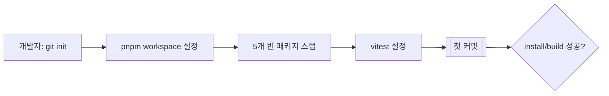

### Phase 1

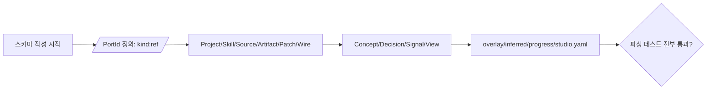

### Phase 2

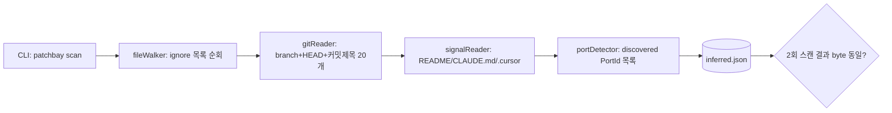

### Phase 3 (게이트)

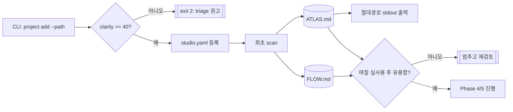

### Phase 4

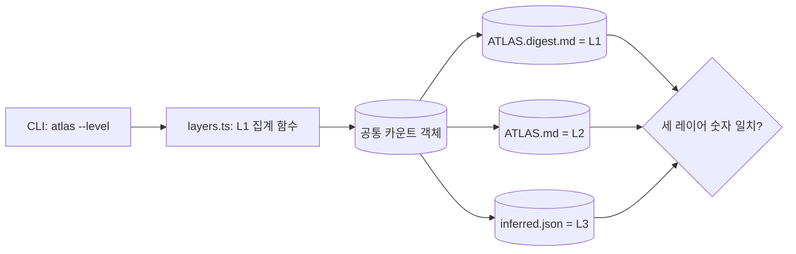

### Phase 5

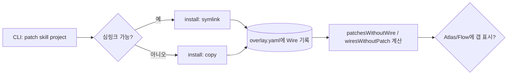

### Phase 6

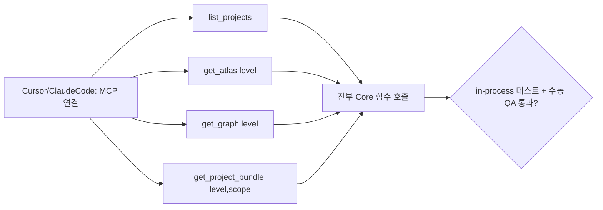

### Phase 7


### Phase 8

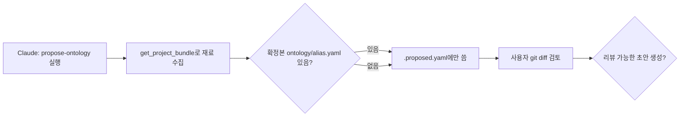

### Phase 9

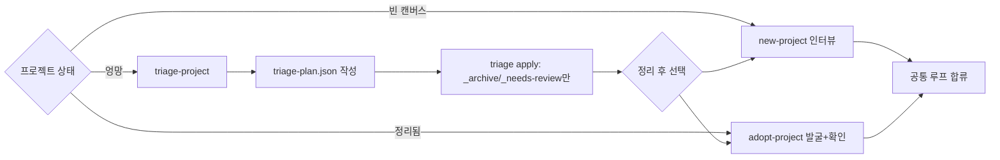

### Phase 10

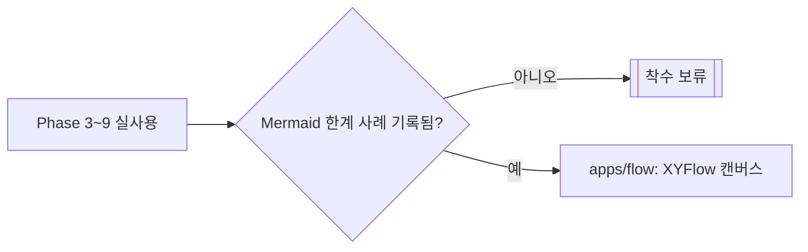

### Phase 11

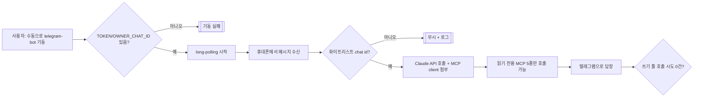

### Phase 12 (20260913a판 신설)

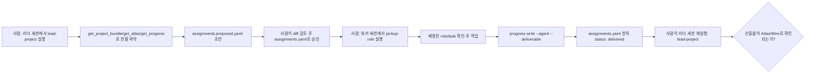

---

## 5. 열린 질문

| # | 질문 | 이 버전에서의 값 |
| --- | --- | --- |
| Q1 | 스튜디오 루트 | `~/.patchbay`, `PATCHBAY_HOME`으로 override |
| Q2 | studio 홈 git | Phase 0에서 별도 `git init` |
| Q3 | 심링크 vs 복사 | 심링크 기본, 실패 시 복사, Wire에 `install` 기록 |
| Q4 | 스킬 정본 (멀티 레포) | v1은 단일 스튜디오. 정본은 `<studio>/skills/`. 미룸 |
| Q5 | git 신호 깊이 | 브랜치+HEAD+최근 커밋 제목 20개. ahead/behind 없음 |
| Q6 | 트랜스크립트 스캔 | v1 OFF |
| Q7 | 온톨로지 표기 | YAML |
| Q8 | flow localhost | v1 Mermaid만. XYFlow 보류 |
| Q9 | clarity score | 7.10절 공식(만점 100). 40 미만만 exit 2 |
| Q10 | progress 동시 갱신 / `_needs-review` 방치 | 동시 갱신: last-write-wins, 문서화만. 방치: 카운트만, 자동 정리 없음 |
| Q11 | 빠른 시작 기본값 | 한 줄 정의 + 성공 조건만 질문 |
| Q12 | adopt 오추정 마찰 | 미확정 |
| Q13 | 생성 파일 git | studio 홈 git에 넣는다. 대상 프로젝트 git엔 안 넣음 |
| Q14 | `studio.yaml` kind | v1은 `local_repo`만 |
| Q15 | PortId slug/fileRef 모호성 | `skill:` fileRef는 반드시 `SKILL.md`로 끝나야 함(7.1절) — 확장자 없는 이름은 항상 Bay slug |
| Q16 | 텔레그램 호스트 배포 방식 | v1은 long-polling, 사용자가 개인 머신에서 수동 기동. 웹훅·상시 클라우드 배포·다중 사용자/그룹챗은 보류 |
| Q17 (20260913a판 신설) | `assignments.yaml` 동시 갱신 | Q10과 동일하게 last-write-wins, 문서화만(기획서 13절 질문 13에 대한 v1 값) |

---

## 6. 참고

- 무엇을 만들지 → `Patchbay_기획_20260913a.md`
- 어떤 순서로 만들지 → `Patchbay_구현계획_20260913b.md` (7절과 충돌하면 이 문서 7절)
- 지금 맞게 가고 있는지 → 이 문서

---

## 7. 구현 구멍 임시 채택값

### 7.1 PortId (모호성 제거)

```
PortId     = kind ":" ref
kind       = "source" | "skill" | "artifact" | "agent" | "signal"
ref        = fileRef | slug
fileRef    = 프로젝트 루트 기준 POSIX 상대경로. 선두 "./" 없음. 역슬래시 없음
slug       = [a-z0-9][a-z0-9-]*     # 스튜디오 Skill Bay 이름
```

**모호성 방지 규칙**: `skill:` kind에서 슬래시나 확장자가 없는 순수 이름(예: `map-project`)은 **항상 스튜디오 Bay의 slug**로 해석한다. 프로젝트 로컬 스킬을 가리키는 fileRef는 반드시 `SKILL.md`로 끝나야 한다(예: `skill:skills/local-foo/SKILL.md`).

예:

- `source:README.md`
- `skill:map-project` — 항상 `<studio>/skills/map-project/` (Bay)
- `skill:skills/local-foo/SKILL.md` — 항상 프로젝트 안 파일 (fileRef, `SKILL.md`로 끝남)
- `artifact:ATLAS.md`
- `agent:writer-01` — Phase 12부터 assignments.yaml에서 쓰임(20260913a판 추가)

파싱 실패(빈 kind, 공백, `..`, 절대경로, `skill:` fileRef인데 `SKILL.md`로 안 끝남)는 스키마 에러다.

### 7.2 Patch / Wire 매칭

```yaml
from: skill:map-project
to: artifact:ATLAS.md
kind: produces               # reads | produces | proposes | uses
```

Wire만 추가: `evidence`(선택, 매칭 키 아님), `install: symlink | copy`.

매칭 키 = `(from, to, kind)`. 할 일 = `patchesWithoutWire`. 발견된 연동 = `wiresWithoutPatch`(버그 아님, 정상).

### 7.3 라벨 없는 잭 (v0)

(이전 판과 동일 — discovered ports 표, `ontology/<alias>.yaml`의 `ports[].id`가 labeled, 온톨로지 없으면 전부 unlabeled)

### 7.4 파일 소유권과 초안

(이전 판과 동일 — inferred/ATLAS/FLOW는 커널 소유·항상 덮어씀, overlay/ontology 확정본/progress/assignments는 스캔이 쓰지 않음, `.proposed.*`는 스킬 초안 전용)

### 7.5 `project new` / triage apply

(이전 판과 동일)

### 7.6 비대화형 CLI

(이전 판과 동일 — TTY 아니면 질문 없음, `project add --path` exit 0/1/2)

### 7.7 스캔 결정성과 ignore (20260913c판: ignore 목록 확장)

ignore (디렉터리 이름 또는 이 경로 세그먼트):

`node_modules`, `.git`, `dist`, `build`, `out`, `.next`, `coverage`, `.turbo`, `.cache`, `venv`, `.venv`, `__pycache__`, `target`, `vendor`, `.pnpm-store`, `Pods`, `.output`, **`__fixtures__`, `__mocks__`, `__snapshots__`(20260913c판 추가)**

(20260913c판 추가 배경) Patchbay 레포 자신을 실제로 `project add`한 뒤에야 드러난 결함이다 — Phase 2의 자동 테스트는 격리된 임시 픽스처만 스캔하기 때문에 몰랐는데, 실제 프로젝트(자기 자신의 소스 트리 안에 `__fixtures__`를 가진 프로젝트)를 스캔하니 스캐너 자신의 테스트 픽스처(가짜 README/AGENTS.md/SKILL.md)가 진짜 신호로 잡혀 `discoveredPorts`와 clarity score를 오염시켰다. `fixtures`(밑줄 없는 형태)는 일부러 빼뒀다 — 실제 제품 콘텐츠로 그 이름을 쓰는 프로젝트도 있을 수 있어서, 테스트 전용임이 명확한 이중 밑줄 컨벤션(Jest/vitest)만 넣었다.

inferred 안정화:

- 모든 배열은 `path` 또는 PortId 오름차순
- `mtime`, `scannedAt`, 로컬 시계, 파일 크기(선택 시에도 스냅샷 비교에서 제외) 없음
- git: `branch`, `head`, `commitSubjects: string[≤20]`
- **ahead/behind 없음** (fetch 금지)

"두 번 스캔하면 같다"는 **같은 커밋의 픽스처**에 대해서만 주장한다.

### 7.8 v1에서 스캐너가 하지 않는 것

(이전 판과 동일 — Agent 자동 탐지, ahead/behind, 트랜스크립트, 원격 fetch, progress 추론, Concept 추출)

### 7.9 레이어 기본값 (의도된 차이)

(이전 판과 동일)

### 7.10 clarity score v0 (만점 100으로 재조정)

0–100, 높을수록 정리됨.

- README.md 존재: **+50**
- 최근 커밋 제목 유니크 비율: `unique(subjects) / max(n,1) * 50` (n≤20)
- 중복 파일명 패턴(`_v2`, `_final`, `_backup`, ` copy`, `복사본`): 개당 −5, 바닥 −30
- 그 외 0

임계값 40 유지 — 만점 100 기준 실제 40%.

### 7.11 Progress write

(이전 판과 동일)

### 7.12 MCP 범위 (Phase 배정)

- **Phase 6**: `list_projects`, `get_atlas`, `get_graph`, `get_project_bundle` (읽기 전용, Core 데이터만 있으면 됨)
- **Phase 7**: `get_progress` — progress write CLI와 같은 시점에 추가한다.
- **미정 (Phase 6/7 이후)**: `patch_skill`, `record_decision`, `get_assignments`(20260913a판 추가) — 대응하는 CLI(`patch`, `record`, `assign`)가 먼저 안정화된 뒤 노출.

### 7.13 Mermaid 노드 (표기 통일)

- id: **`n` + hex(sha1(PortId))[0..12]** — 언더스코어 없음. 3절 Phase 3 체크리스트와 반드시 같은 문자열이어야 한다.
- 표시 라벨: PortId 또는 상대경로, 따옴표로 감싼다.

### 7.14 Atlas 가시성 완화

스튜디오 파일(`ATLAS.md` 등)이 대상 프로젝트 레포 밖(`~/.patchbay`)에 있어서(Q13), 프로젝트만 열린 Cursor 워크스페이스에서는 파일 트리에 보이지 않는다.

- **MCP 경로는 문제 없음** — Cursor/Claude Code의 AI가 `get_atlas`를 호출하는 건 워크스페이스 루트와 무관하다. 제한되는 건 **사람이 파일 탐색기로 직접 열어보는 경로**뿐이다.
- 완화책(v1): `project add`/`scan`이 끝나면 `ATLAS.md`의 절대경로를 항상 stdout에 출력한다. `map-project` SKILL.md에 이 경로를 사용자에게 안내하는 문구를 포함한다.
- 완전한 해결(스튜디오 홈을 두 번째 워크스페이스 폴더로 자동 추가 등)은 v1 범위 밖.

### 7.15 이번 채택에서 명시적으로 빼는 것

(이전 판과 동일 + 추가 없음)

### 7.16 Telegram 호스트

- 패키지: `apps/telegram-bot` (Core/MCP 재사용, Core를 직접 열지 않음 — 다른 호스트와 동일 원칙)
- 인증: `TELEGRAM_BOT_TOKEN` + `TELEGRAM_OWNER_CHAT_ID`(단일 chat id 화이트리스트). 여러 사용자/그룹챗은 v1 범위 밖
- 기동: 수동, long-polling. 웹훅·자동 기동(launchd/systemd 등)은 v1 범위 밖
- 권한: 읽기 전용. Phase 6/7에서 이미 정의된 MCP 5종만 노출
- 상태: 대화 히스토리는 프로세스 메모리에만 존재, 재시작 시 소실. `progress.yaml`이나 다른 studio 파일에 쓰지 않음
- 실패 처리: 토큰 만료/네트워크 오류는 텔레그램 답장으로 노출, 프로세스는 유지
- 원칙 10과의 관계: 이 프로세스는 "상시 켜져 있어야" 동작하는 것이 기능의 본질이므로 **원칙 10의 명시적 예외**로 둔다. 예외 조건: (a) 수동 기동만 허용, (b) 읽기 전용, (c) studio 파일을 쓰지 않음.

### 7.17 멀티 에이전트 역할 분담 (20260913a판 신설)

- 파일: `assignments.yaml`(확정, 사람 소유) / `assignments.proposed.yaml`(스킬 초안). 스캔이 덮어쓰지 않음(7.4절과 동일 규칙)
- 소유권: overlay.yaml과 동일 계열 — **사람 소유**, `.proposed.*`는 스킬 초안 전용(원칙 3)
- 동시 갱신: progress.yaml과 동일하게 **last-write-wins, 문서화만**(Q17, 기획서 13절 질문 13)
- 무응답/이탈 감지: v1은 없음. 사람이 직접 확인(기획서 13절 질문 14) — 자동 타임아웃·알림을 만들지 않는다(원칙 10 정신)
- 노출 순서: MCP `get_assignments`는 아직 없음. CLI(`assign`)가 먼저 안정화된 뒤 노출(7.12절과 같은 순서 원칙)
- 실행 경계: `lead-project`/`pickup-role` 스킬은 파일을 읽고 쓸 뿐, 다른 세션·다른 LLM API를 직접 호출하지 않는다(원칙 6, 자가점검 15번)

### 7.18 `ATLAS.md` 콘텐츠 매핑 (20260913b판 신설)

Phase 3 구현 중 실제로 결정한 값. 기획서 5.1/9.4절도, 이 문서의 이전 판도 `## Skills`/`## Rules`/`## Unlabeled ports`에 정확히 뭐가 들어가는지는 규정하지 않았다 — v1엔 온톨로지가 아직 없어서(Phase 8) "라벨"이라는 개념 자체가 성립하지 않기 때문이다. 아래는 그 공백을 메운 구현 시점 결정이며, 기획서 다음 개정에서 흡수해야 한다(8절 부채 항목 5로 추가).

- **`## Skills`** — `overlay.patches` 중 `from`이 `skill:` 종류인 것들의 distinct 목록(이미 이 프로젝트에 패치된 스킬). Phase 3엔 `overlay.yaml`이 비어 있으므로(Patch/Wire 작성은 Phase 5) 보통 `없음` — 버그 아님, 정상. Patch 데이터가 생기면 렌더러 수정 없이 그대로 채워진다.
- **`## Rules`** — `inferred.discoveredPorts` 중 `source:` 종류 전부. Phase 2 스캐너가 찾는 게 정확히 README/AGENTS.md/CLAUDE.md/`.cursor/rules`뿐이므로, 이건 곧 "발견된 LLM용 컨텍스트 신호 전체"와 같다.
- **`## Unlabeled ports`** — `inferred.discoveredPorts` 중 `skill:` 종류 전부(발견됐지만 아직 아무도 패치하지 않은 SKILL.md). Patchbay의 "라벨 없는 잭" 개념이 가장 직접적으로 드러나는 자리다.

구현: `packages/core/src/render/atlasRenderer.ts`. 각 섹션은 정렬된 PortId를 `- <PortId>` 불릿으로 나열하거나, 비어 있으면 리터럴 `없음`.

---

## 8. 문서 간 미해결 부채 (이번에 다루지 않음, 후속 필요)

이 문서(명세)의 범위를 벗어나 **기획서/디자인 쪽 수정이 필요한** 항목. 7절 우선 규칙으로 구현은 막히지 않지만, 방치하면 문서들이 계속 어긋난다.

1. **기획서_c 13절 번호 오류** — "1~8 동일"이라 적어놓고 괄호 안엔 b판 Q9·Q10까지 10개를 나열한 뒤 c판 신규 항목을 다시 9부터 매겨 번호가 겹친다. 20260913a판 기획서에도 아직 남아있다 — 다음 개정에서 정정 필요.
2. **triage 범위 축소가 기획서에 반영 안 됨** — 이 문서 6.5절/1.3절은 "살아있는 코드 재배치는 v1 범위 밖"이라 하는데, 기획서 6.3절 5번 단계는 아직 그걸 포함한 서술로 남아 있다.
3. **UI 목업과 스펙 불일치** — 이전에 만든 "Patchbay Concept UI" 캔버스의 Atlas 카드가 git ahead count("+12")를 표시하는데, 7.8절(스캐너가 안 하는 것)은 ahead/behind를 명시적으로 뺐다.
4. **기획서에 텔레그램 호스트 미반영** — 이 문서 1.1절/7.16절에서 텔레그램 봇을 새 상시 호스트로 결정했지만, 기획서의 호스트 목록·아키텍처 서술에는 아직 없다.
5. **(20260913b판 신설) 기획서에 `ATLAS.md` 콘텐츠 매핑 미반영** — 7.18절에서 Skills/Rules/Unlabeled ports가 각각 뭘 보여주는지 구현 시점에 확정했지만, 기획서 5.1절("등록된 프로젝트, 스택, 스킬, 문서, 라벨 없는 잭")은 이 정도로 구체적이지 않다.

---

## 9. 변경 이력

| 버전 | 날짜 | 내용 |
| --- | --- | --- |
| 20260912a | 2026-09-12 | 최초 명세. 다이어그램 + Phase 체크리스트 |
| 20260912b | 2026-09-12 | 구현 구멍 임시 채택값(6절): PortId, Patch/Wire 매칭, 잭 정의, 파일 소유권, 비대화형 CLI, progress write, triage apply 범위 |
| 20260912c | 2026-09-12 | `get_progress` 복원, Mermaid 노드ID 표기 통일, clarity score 만점 100 재조정, PortId 모호성 규칙 추가, Atlas 가시성 완화책 추가, Phase별 내부 진행 흐름 다이어그램(4절) 신설, 문서 간 미해결 부채(8절) 명시 |
| 20260912d | 2026-09-13 | 텔레그램 원격 호스트(`apps/telegram-bot`, v1 읽기 전용) 신설 |
| 20260913a | 2026-09-13 | 멀티 에이전트 역할 분담(파일 매개형) 신설 — Phase 12 체크리스트/진행흐름, 원칙 자가점검 15번, Q17, 7.17 채택값 추가 |
| 20260913b | 2026-09-13 | Phase 0~3 실제 구현·검토·머지 완료 표시. studio 홈 초기화 Phase 0→3 이동 반영, `ATLAS.md` 콘텐츠 매핑 7.18절 신설, 문서 간 미해결 부채 5번 추가 |
| 20260913c | 2026-09-13 | Phase 3 약식 실사용 중 발견한 결함 반영 — ignore 목록에 `__fixtures__`/`__mocks__`/`__snapshots__` 추가(7.7절), Phase 2 체크리스트에 발견 경위 기록, Phase 3 제품 게이트에 실사용 1회 결과 기록(완전 판정은 아직) |
